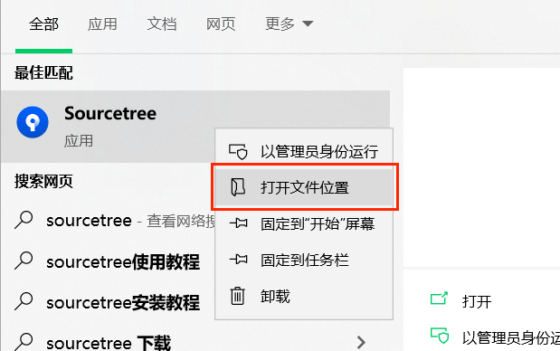
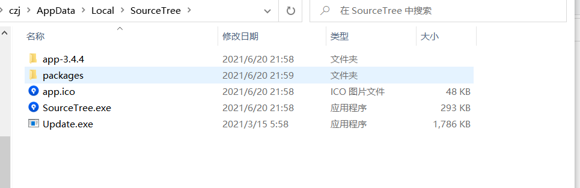
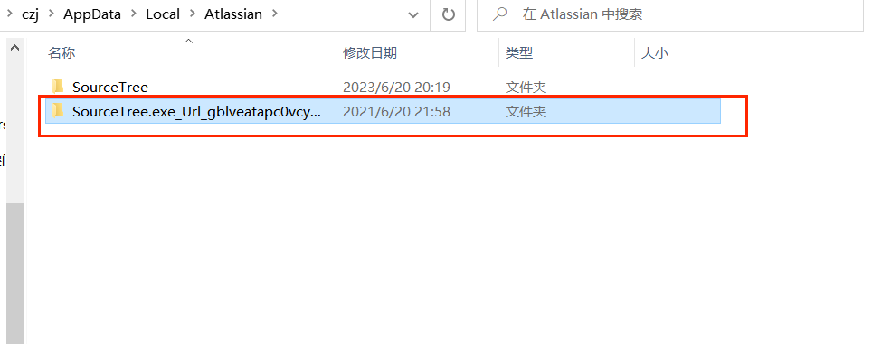
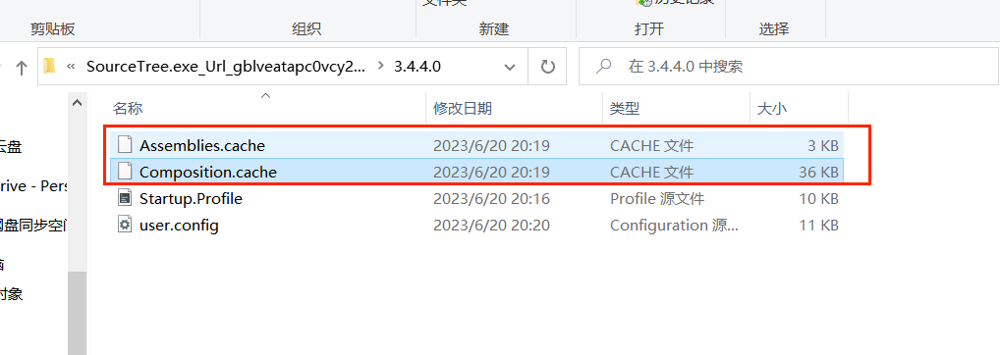

今天sourcetree突然打不不开了，一开始还以为开机时间长了的原因，重启电脑发现还是打不开
首先找到sourcetree文件夹

如果打开的文件夹只有一个快捷方式，那么在这个快捷方式上右键找到快捷方式的文件位置

回到Local下的Atlassian文件夹，找到SourceTree.exe_开头的文件夹进入

里面有个sourcetree版本号的文件夹，我是3.4.4.0点击进入
删掉Assemblies.cache和Composition.cache这两个文件
