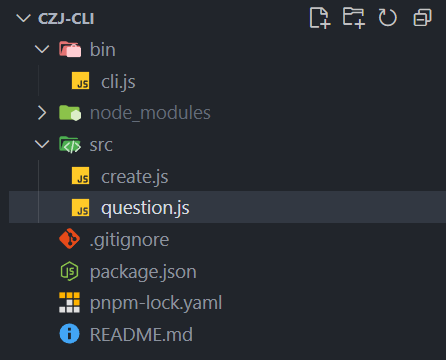
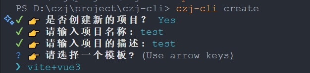

## cli工具

### 项目代码地址

项目代码地址  
[czj-cli](https://github.com/czj0923/czj-cli)  
npm包地址  
[czj-cli](https://www.npmjs.com/package/@caozhijie/czj-cli)

### cli需要用到的工具库

| 名称              | 简介                            | 备注                                 |
| ----------------- | ------------------------------- | ------------------------------------ |
| commander         | 命令行自定义指令，比如说 -v, -c | esm和cjs都能用                       |
| chalk             | 美化样式，高亮字体              | esm使用5及以上版本，cjs使用5以下版本 |
| inquirer          | 交互式回答                      | esm和cjs都能用                       |
| ora               | 加载的动画效果                  | esm使用6及以上版本，cjs使用6以下版本 |
| download-git-repo | 下载远程模板                    | 只有cjs版本                          |
| fs-extra          | 文件系统操作                    |                                      |

::: info
esm相对于cjs有诸多优势，现在越来越多的包都在使用esm，所以优先使用esm版本，以下示例使用的是cjs，后续可能会更新成esm版本。
:::

### 开发

新建文件夹并安装依赖

```bash
mkdir czj-cli
cd czj-cli
npm init -y     //快速生成package.json
pnpm add commander chalk inquirer ora download-git-repo fs-extra    //安装依赖
```

> 注意依赖包要安装在dependencies当中

`package.json`参考

```json
{
  "name": "@caozhijie/czj-cli",
  "version": "1.0.0",
  "description": "A tool for quickly creating project development templates",
  "main": "./bin/cli.js",
  "bin": {
    "czj-cli": "./bin/cli.js"
  },
  "scripts": {
    "test": "echo \"Error: no test specified\" && exit 1"
  },
  "keywords": ["cli"],
  "author": {
    "name": "Cao Zhijie",
    "email": "1051029537@qq.com",
    "url": "https://github.com/czj0923"
  },
  "license": "MIT",
  "dependencies": {
    "chalk": "^4.1.2",
    "commander": "^14.0.0",
    "download-git-repo": "^3.0.2",
    "fs-extra": "^11.3.0",
    "inquirer": "^12.8.2",
    "ora": "^5.4.1"
  }
}
```

> bin，是为了"npm link"正常使用，“czj-cli“作为命令行的名字

把这个命令映射到全局

```bash
npm link
```

### 文件结构



在bin目录下新建cli.js文件

```js
#! /usr/bin/env node //用于解释程序的脚本

const inquirer = require('inquirer');
const question = require('../src/question');
const chalk = require('chalk');
const createProject = require('../src/create');
const { program } = require('commander');

const { red } = chalk;
const package = require('../package.json');

program.version(package.version);

program
  .command('create')
  .description('创建一个项目')
  .action(function () {
    inquirer.default
      .prompt(question.create)
      .then(async (answer) => {
        if (answer.conf) {
          createProject(answer);
        } else {
          red(`您已经终止此操作`);
        }
      })
      .catch(() => {
        red(`❌ 程序出错 ❌`);
        process.exit(1);
      });
  });

// 解析命令行，这个一定要加上，不然打印不出信息
program.parse(process.argv);
```

src目录下新建create.js

```js
const download = require('download-git-repo');
const ora = require('ora');
const chalk = require('chalk');

const { red, yellow, green } = chalk;

function createProject(project) {
  //获取用户输入，选择的信息
  const { template, name } = project;
  const spinner = ora('正在拉取框架...');
  spinner.start();
  download(template, name, async function (err) {
    if (err) {
      red(err);
      spinner.text = red(`拉取失败. ${err}`);
      spinner.fail();
      process.exit(1);
    } else {
      spinner.text = green(`拉取成功...`);
      spinner.succeed();
      spinner.text = green(`项目已创建成功！`);
      spinner.succeed();
    }
  });
}

module.exports = createProject;
```

src目录下新建question.js

```js
const fse = require('fs-extra');

const create = [
  {
    name: 'conf',
    type: 'confirm',
    message: '👉 是否创建新的项目？'
  },
  {
    name: 'name',
    message: '👉 请输入项目名称:',
    validate: function (val) {
      if (!val) {
        return '请输入项目名称';
      }
      if (fse.existsSync(val)) {
        return '当前目录已存在同名的项目，请更换项目名';
      }
      return true;
    },
    when: (res) => Boolean(res.conf)
  },
  {
    name: 'desc',
    message: '👉 请输入项目的描述:',
    when: (res) => Boolean(res.conf)
  },
  {
    name: 'template',
    type: 'list',
    message: '👉 请选择一个模板?',
    choices: [
      {
        key: 'a',
        name: 'vite+vue3',
        value: 'github:czj0923/vite-vue-template'
      }
    ],
    filter: function (val) {
      return val.toLowerCase();
    },
    when: (res) => Boolean(res.conf)
  }
];

module.exports = {
  create
};
```

### 效果



## 发布到npm

具体发包流程可看我的这篇博客[发布npm包](/blogs/code/npm-package)  
我的cli包命名：`@caozhijie/czj-cli`  
全局安装：`pnpm i @caozhijie/czj-cli -g`  
使用： `czj-cli create`
