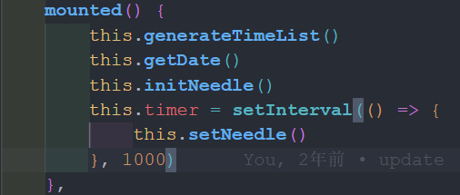

1.之前github自动部署失败了，一直没管，最近想起来修改，查看git actions报错日志，发现执行到pnpm run build成功之后就没有退出，导致无法执行下一步。
最终发现是Clock.vue这个组件的原因
因为vuepress是服务端渲染的，不能在created使用setInterval之类的定时器。

把定时器放到mounted里面就可以了

2.vuepress-theme-reco2经常更新，每次更新就会有配置项的改变，但是官网的文档又只列举了最新的配置项，导致想要修改之前的配置项时无从下手，只能被迫更新到最新的版本，需要重新去查看文档修改配置。

3.主题默认把.vuepress/components下的组件自动注册为全局组件，如果是多层目录下的组件，调用时需在组件名前加上`目录名-`，这是在文档上没有说明的。

4.运行pnpm run dev后，浏览器时常会报`Error: useClientData() is called without provider.`的错误，删掉`.vuepress/.cache`重启项目即可解决。