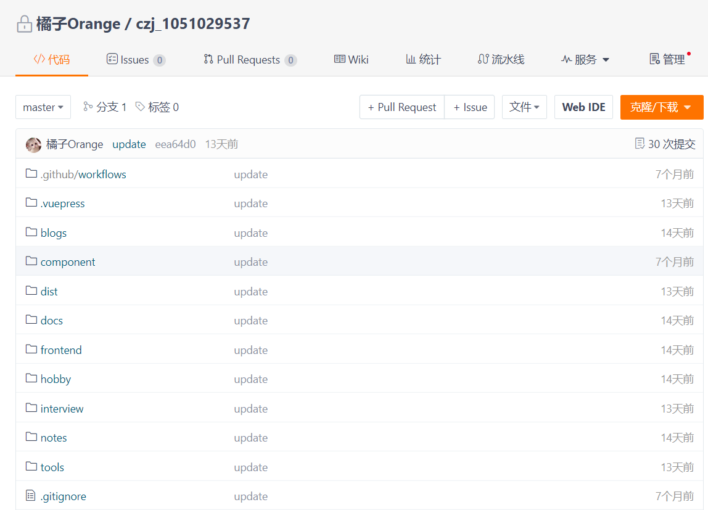
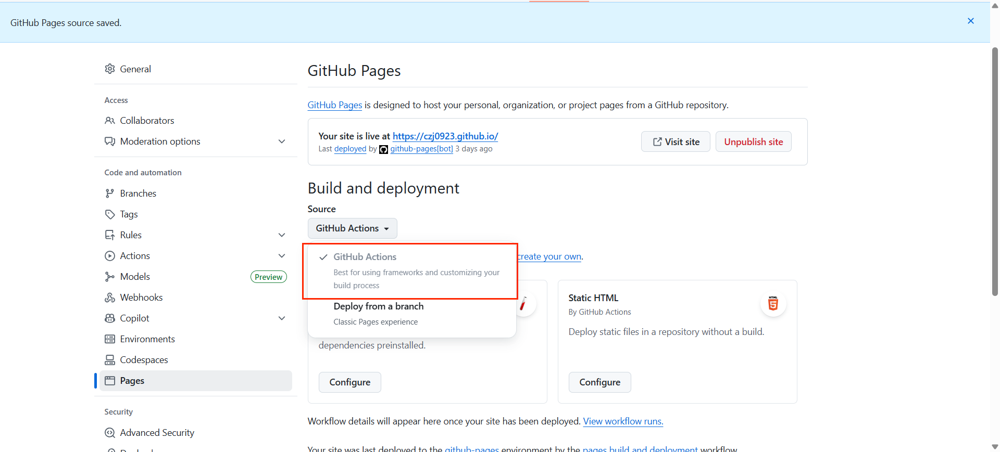

# VuePress + vuepress-theme-reco搭建个人博客

## 使用技术

VuePress + vuepress-theme-reco

## VuePress

[VuePress2官方文档](https://v2.vuepress.vuejs.org/zh/)\
由于使用的是主题，所以不用vuepress创建项目

## vuepress-theme-reco

[vuepress-theme-reco文档地址](https://vuepress-theme-reco.recoluan.com/)

::: tip 提示
此主题几乎继承 VuePress 默认主题的一切功能。
:::

### 创建项目

```bash
# 初始化，并选择 2.x
npm install @vuepress-reco/theme-cli@1.0.7 -g
theme-cli init
```

具体的使用方法可查阅官方文档

## 部署到Gitee Page&GitHub Page

### Gitee Page

1. 新建仓库  
   使用 [czj_1051029537.gitee.io](https://czj_1051029537.gitee.io?_blank) 访问首页，不带二级目录的 pages，需要建立一个与自己个性地址同名的仓库。
2. 提交代码至创建的仓库
   
3. 部署gitee page
   

### GitHub Pages

选择`Github Actions`，其他操作和gitee类似


### 自动推送和部署

在根目录创建一个shell文件

```sh
read -p  "请填写commit提交的信息:" msg

# 空值判断
if [ ! $msg ]; then
    echo "终止提交，因为提交说明为空。"
else
    # 添加到暂存区
    echo "\n\n开始执行add-commit操作......"
    git add .

    # 提交
    git commit -m "$msg"
    echo "commit完毕，开始拉取以及推送代码\n"

    # 推送到github
    echo "开始推送到github\n"
    git push github master

    # 推送到gitee
    echo "开始推送到gitee\n"
    git push gitee master

    if [ $? -eq 0 ]; then
        echo "\n\n流程结束，完成提交。"
    else
        echo "\n\n出错了,请解决错误"
    fi
fi
```

github ci/cd文件

```yml
name: 部署

on:
  push:
    branches:
      - master

permissions:
  contents: read
  pages: write
  id-token: write

# 只允许同时进行一次部署，跳过正在运行和最新队列之间的运行队列
# 但是，不要取消正在进行的运行，因为我们希望允许这些生产部署完成
concurrency:
  group: pages
  cancel-in-progress: false
jobs:
  build:
    runs-on: ubuntu-latest
    steps:
      - name: Checkout
        uses: actions/checkout@v4
        with:
          fetch-depth: 0

      - name: 安装 pnpm
        uses: pnpm/action-setup@v4
        with:
          version: 8

      - name: 设置 Node.js
        uses: actions/setup-node@v4
        with:
          node-version: 22
          cache: pnpm

      - name: 安装依赖
        run: pnpm install

      - name: 打包
        env:
          NODE_OPTIONS: --max_old_space_size=8192
        run: |-
          pnpm run build

      - name: upload artifact
        uses: actions/upload-pages-artifact@v3
        # 将./dist目录中生成的静态网站文件打包并上传。
        # 这个产物（artifact）后续会被 `deploy` 作业使用。
        with:
          path: ./dist
  # 部署工作
  deploy:
    environment: # 部署环境
      name: github-pages # 部署到 GitHub Pages
      url: ${{ steps.deployment.outputs.page_url }} # 部署后的 URL
    needs:
      build # 指定 deploy 作业依赖于 build 作业。
      # 也就是说，只有当 `build` 作业成功完成后，`deploy` 作业才会开始执行。
    runs-on: ubuntu-latest # 运行环境
    name: Deploy # 工作名称
    steps: # 步骤
      - name: Deploy to GitHub Pages # 部署到 GitHub Pages
        id: deployment # 给这个步骤一个ID，名为 `deployment`，这样其他地方就可以引用它的输出。
        uses: actions/deploy-pages@v4 # 使用的 action，它会获取由 `build` 作业上传的构建产物
```

在终端执行 sh deploy.sh即可自动推送及部署
::: info 提示
Gitee Pages 个人版不支持提交自动更新，需要手动更新。
:::
