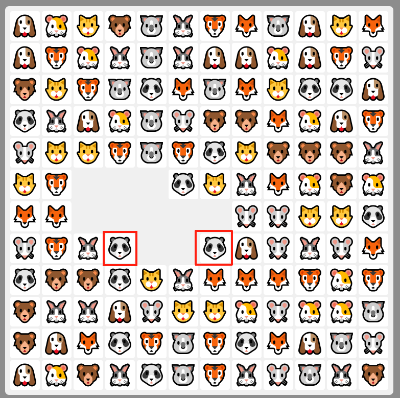
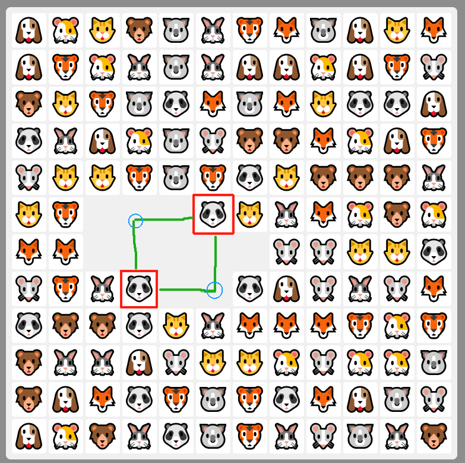
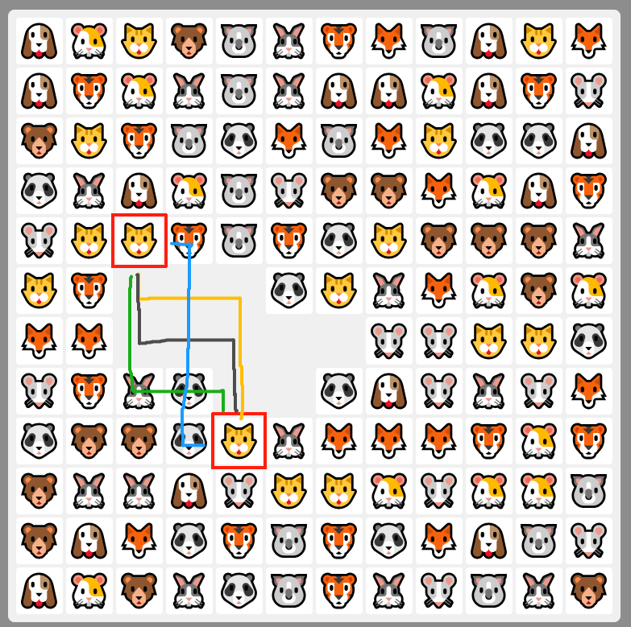

## 技术栈
1. 构建工具：vite7
2. 前端框架：vue3
3. typescript
4. 样式：sass
5. 状态管理：pinia

## 游戏说明
连连看小游戏是一款经典的益智游戏，玩家需要通过连接相同的图案来消除它们。游戏的目的是在限定时间内尽可能多地消除所有匹配的图案，以获得更高的分数和排名。游戏通常包含一系列的图片或图标，玩家需要找出并连接这些图片对，每次成功连接一对即可得分。

## 实现思路

### 核心功能
判断两个格子能否消除无非三种情况：
#### 不用转弯
如下图红框圈出两个格子所示

这种情况路径是只有一种，只需判断这两个点之间是否有障碍物（未消除格子）即可，没有障碍物就可以消除。
定义了`checkStraightLine`函数，实例代码
```js
function checkStraightLine(p1: Point, p2: Point, board: number[][]): boolean {
  // 不是在同一行或列上，则不能直接连接
  if (p1.x !== p2.x && p1.y !== p2.y) return false;
  // p1.x === p2.x 说明在同一列
  const start = p1.x === p2.x ? Math.min(p1.y, p2.y) : Math.min(p1.x, p2.x);
  const end = p1.x === p2.x ? Math.max(p1.y, p2.y) : Math.max(p1.x, p2.x);
  // 遍历中间的格子，看是否有障碍物阻挡连接
  for (let i = start + 1; i < end; i++) {
    if (p1.x === p2.x && board[p1.x][i] !== 0) return false;
    if (p1.y === p2.y && board[i][p1.y] !== 0) return false;
  }
  return true;
}
```
#### 转弯一次
如下图红框圈出两个格子所示

这种情况路径是只有两种（上图绿色路径），转角点也只有两个（上图蓝圈），只需分别判断这两种情况即可。假设两个待消方块的坐标分别是`p1(x1, y1)`和`p2(x2, y2)`，那么转角点坐标分别是`(x1, y2)`、`(x2, y1)`。然后判断转角点分别到p1和p2的路径上是否有障碍物即可，实现逻辑和第一种情况一样。

#### 转弯两次
如下图红框圈出两个格子所示

这种情况比上面两种稍微复杂些，但思路是类似的。  
假设两个待消方块的坐标分别是`p1(x1, y1)`和`p2(x2, y2)`，由于转弯是直角的，所以两次转弯的转角点的x和y必然有一个是相同的。  
若是x相同，则两个转角点的y一个是y1，另一个是y2，需要遍历盘面的宽，两个转角点的坐标记为`corner1(i, y1)`和`corner2(i, y2)`，然后利用情况1的`checkStraightLine`函数来分别判断`p1到corner1`、`corner1到corner2`、`corner2到p2`这三段的路径上是否有障碍物，没有即可消除。  
y相同的情况同理


### 道具
#### 提示功能
遍历盘面获取两个非空格子，用之前实现的`canConnect`函数判断是否可以消除，如果可以则返回两个点的数组。

#### 打乱功能
打乱分为三步，首先要收集盘面上所有未消除的格子，然后随机打乱这些格子的位置，最后将打乱的格子重新渲染到盘面上。为了使打乱后的格子位置不变，通过存储的格子两两交换实现  
实例代码
```js
for (let i = numbers.length - 1; i > 0; i--) {
  const j = Math.floor(Math.random() * (i + 1));
  [numbers[i], numbers[j]] = [numbers[j], numbers[i]];
}
```
#### 撤销功能
`gameHistory`数组存储每次消除的格子信息，这个信息包含了盘面数组，分数，游戏时间，难度。每次点击撤销就从这个数组中pop出最后一个元素，并将其渲染到盘面上。

### 排行榜功能
利用`localStorage`存储排行榜数据，每次存储时把分数从高到低进行排序，并通过封装好的函数进行读取存储记录。

### 消除路径
判断一次转弯的函数`checkOneCorner`和判断两次转弯的函数`checkTwoCorner`在可消除的情况下返回的是转角点坐标，`p1+转角点坐标+p2`构成了消除路径，将这些点渲染到盘面上即可。

### 其他
#### 游戏结束
每次消除都要检查是否所有方块都已消除，若没有全消除，则需判断是否存在可消除的方块，若不存在则判断检查是否还有可用的道具，若没有道具则游戏结束。

#### 点击方块
若点击的已消除方块，则不进行任何操作；若点击的未消除方块，则判断是否已选中，如果未选中，则把这个方块添加到`selectedPoint`，如果已选中，把`selectedPoint`清空。然后判断是否可消除，如果可以消除，则进行以下操作：把该方块和对应方块的`value`设为`0`，保存当前状态用于撤销，显示连线动画，检查游戏状态。


## 在线demo

连连看小游戏 [点击试玩](https://czj0923.github.io/link-game).

## 开发

### 克隆代码

```bash
git clone https://github.com/czj0923/link-game.git
```

### 进入项目目录

```bash
cd link-game
```

### 安装依赖

```bash
pnpm install
```

### 启动服务

```bash
pnpm run dev
```

### 打包

```bash
pnpm run build
```