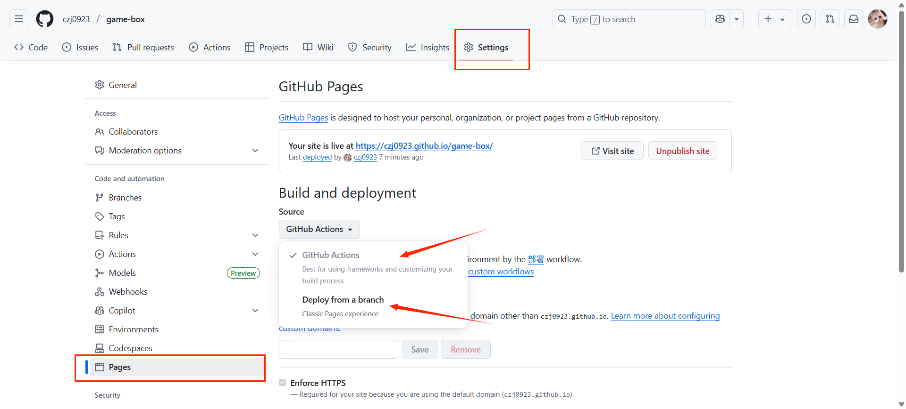
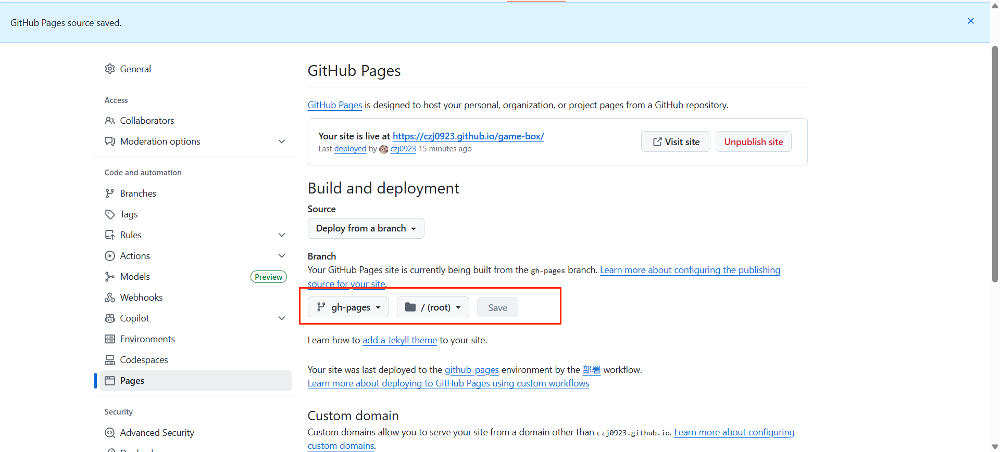
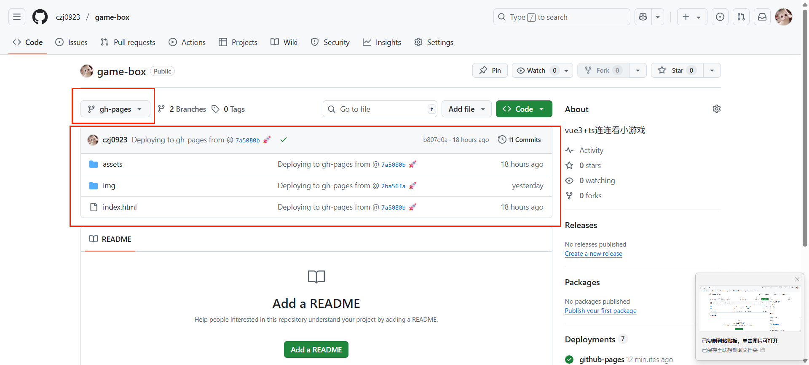
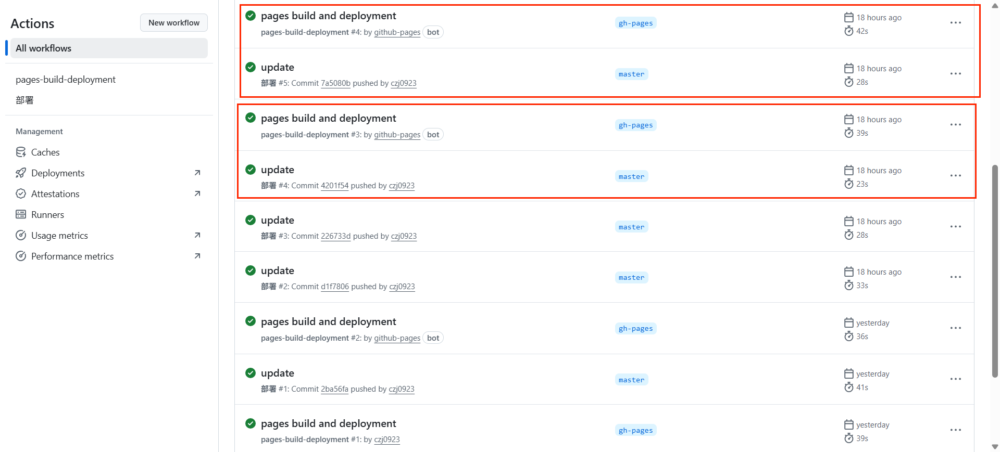
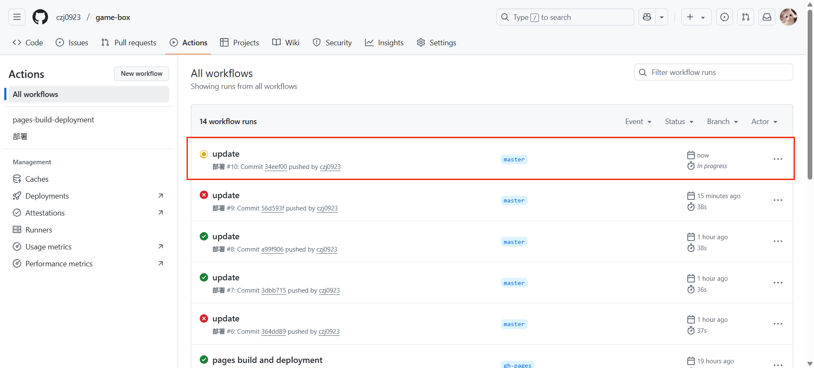
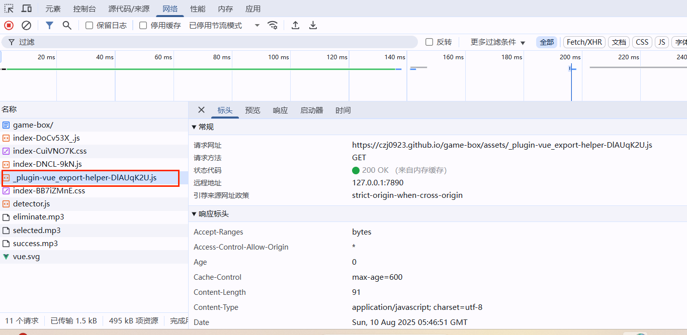

# 配置项目自动部署到github pages

## 启用 GitHub Pages

1. 进入刚创建的仓库，点击 "Settings"。
2. 在左侧导航栏中，选择 "Pages"。
3. 在 "Build and deployment" 中有两种选项，优先选择`Github Actions`，下面介绍两种部署方式的不同。



::: info 提示
GitHub Pages 免费托管要求仓库公开。  
若使用了vue-router，请切换到hash路由，github page不支持history路由模式。
:::

## Deploy from a branch（从分支部署）

branch选择gh-pages下的root目录，然后点击save。

在项目根目录（仓库根目录）添加目录 `.github/workflows/main.yml`配置文件，新增如下内容：

```yml
name: 部署

on:
  push:
    branches:
      # 确保这是你正在使用的分支名称
      - master

permissions:
  contents: write

jobs:
  deploy-gh-pages:
    runs-on: ubuntu-latest
    steps:
      - name: Checkout
        uses: actions/checkout@v4
        with:
          fetch-depth: 0
          # 如果你文档需要 Git 子模块，取消注释下一行
          # submodules: true

      - name: 安装 pnpm
        uses: pnpm/action-setup@v4
        with:
          version: 8

      - name: 设置 Node.js
        uses: actions/setup-node@v4
        with:
          node-version: 22
          cache: pnpm

      - name: 安装依赖
        run: pnpm install

      - name: 构建文档
        env:
          NODE_OPTIONS: --max_old_space_size=8192
        run: |-
          pnpm run build

      - name: 部署
        uses: JamesIves/github-pages-deploy-action@v4
        with:
          # 这是部署到的分支名称
          branch: gh-pages
          folder: ./dist
```

此时当push到master分支时，会自动构建并部署到gh-pages分支。  
进入github的gh-pages分支发现存放的是打包后的dist文件夹  

同时网页也已自动部署到github pages  
但是这样做有个缺点，需要两个 workflow 才能完成，一个是我们自己的打包 workflow, 一个是 Github Pages 本身的 workflow。我们提交代码，触发自己的工作流，打包完成会提交到 gh-pages分支，之后由于 Github Pages 监听这个分支，然后触发了 Github Pages 的重新部署。


### 提示

会报`_plugin-vue_export-helper.js`404  
解决办法可查看我的这篇博客[Vite + Vue项目GitHub Pages 部署后 \_plugin-vue_export-helper.js 404](/blogs/code/6)

## Github Actions

在项目根目录（仓库根目录）添加目录 `.github/workflows/main.yml`配置文件，新增如下内容：

```yml
name: 部署

on:
  push:
    branches:
      - master

permissions:
  contents: read
  pages: write
  id-token: write

# 只允许同时进行一次部署，跳过正在运行和最新队列之间的运行队列
# 但是，不要取消正在进行的运行，因为我们希望允许这些生产部署完成
concurrency:
  group: pages
  cancel-in-progress: false
jobs:
  build:
    runs-on: ubuntu-latest
    steps:
      - name: Checkout
        uses: actions/checkout@v4
        with:
          fetch-depth: 0

      - name: 安装 pnpm
        uses: pnpm/action-setup@v4
        with:
          version: 8

      - name: 设置 Node.js
        uses: actions/setup-node@v4
        with:
          node-version: 22
          cache: pnpm

      - name: 安装依赖
        run: pnpm install

      - name: 打包
        env:
          NODE_OPTIONS: --max_old_space_size=8192
        run: |-
          pnpm run build

      - name: upload artifact
        uses: actions/upload-pages-artifact@v3
        # 将./dist目录中生成的静态网站文件打包并上传。
        # 这个产物（artifact）后续会被 `deploy` 作业使用。
        with:
          path: ./dist
  # 部署工作
  deploy:
    environment: # 部署环境
      name: github-pages # 部署到 GitHub Pages
      url: ${{ steps.deployment.outputs.page_url }} # 部署后的 URL
    needs:
      build # 指定 deploy 作业依赖于 build 作业。
      # 也就是说，只有当 `build` 作业成功完成后，`deploy` 作业才会开始执行。
    runs-on: ubuntu-latest # 运行环境
    name: Deploy # 工作名称
    steps: # 步骤
      - name: Deploy to GitHub Pages # 部署到 GitHub Pages
        id: deployment # 给这个步骤一个ID，名为 `deployment`，这样其他地方就可以引用它的输出。
        uses: actions/deploy-pages@v4 # 使用的 action，它会获取由 `build` 作业上传的构建产物
```

查看actions可以看到只触发了一个workflow

用这种方式部署`_`下划线开头的文件都能够正常读取，不需要再修改rollup配置文件。


## 总结

从分支部署（Deploy from a branch）的缺点：

1. 文件中不能包含特殊字符，比如`_`，`.`，否则文件会404。
2. 项目会多一个`gh-pages`分支，不方便管理。

最终选择使用 `Github Action` 直接部署 Github Pages， 完美又优雅

[参考](https://juejin.cn/post/7352797634556395535)
