# vscode常用插件推荐

这里列举的是我使用vscode所用到的插件

## 1.Chinese (Simplified) (简体中文)

适用于 VS Code 的中文（简体）语言包。

## 2.Auto Rename Tag

同步修改 `HTML/XML`标签。

## 3.open in browser

提供右键菜单选项，一键在浏览器打开`html`文件。
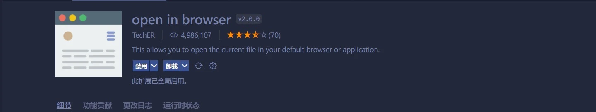
可以选择在默认浏览器打开或者选择自己想用的浏览器打开。

## 4.Live Server

开启一个实时的本地服务器。
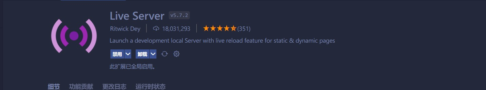
一个非常好用的插件，相比于`open in browser`每次保存文件后到浏览器都要刷新才能看到最新的变化，有了这个插件，就可以实时监听文件的变化，自动刷新。真的非常推荐刚开始学`html`，`css`，`js`的同学使用这个插件学习，很方便。
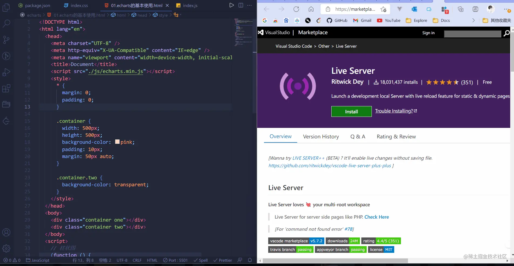

## 5.Path Intellisense

智能路径补全。
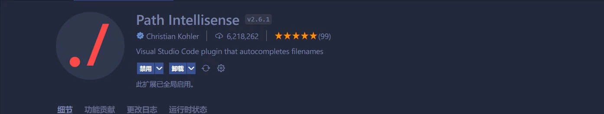
其实VSCode对大部分都是有路径感知的，这个插件的一个比较好的功能是配置路径别名，用框架写项目的时候用的会比较多。
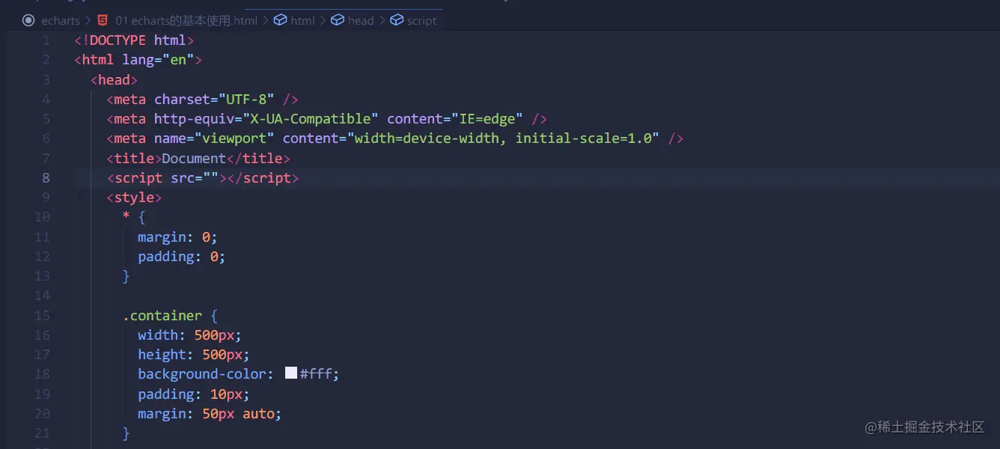

## 6.Easy LESS

它可以直接编译less 自动保存为css文件
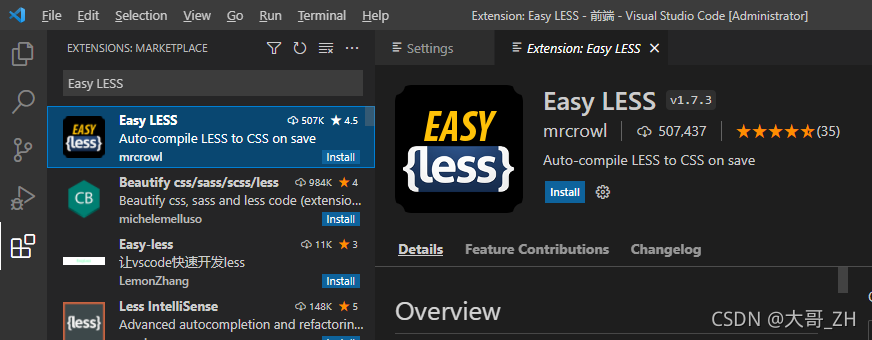

## 7.JavaScript (ES6) code snippets

`es6`等代码块，语法提示
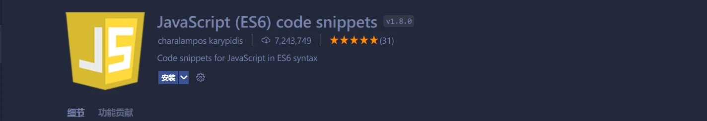

## 8.One Dark Pro

最受欢迎的暗黑主题，也是VSCode中下载量最高的主题。
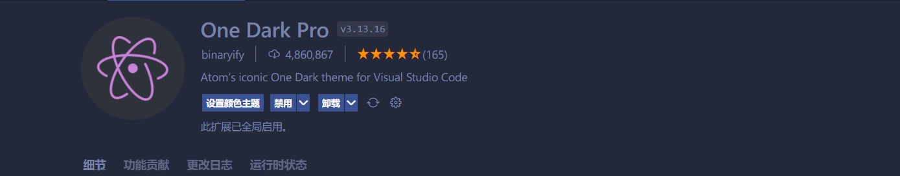

## 9.Material Icon Theme

拥有超多的文件图标，下载量也是最高。

## 10.GitLens

Git历史记录
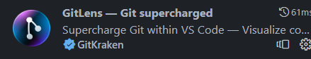

## 11.CSS Peek

css定位器

## 12.Auto Close Tag

输入开始标签后，自动添加结束标签。
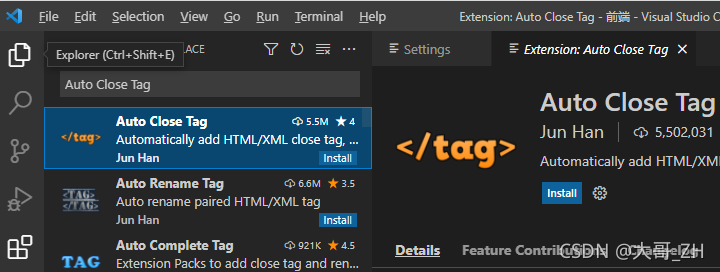

## 13.HTML CSS Support

在VScode中提示CSS相关扩展 这是写CSS代码快捷神器
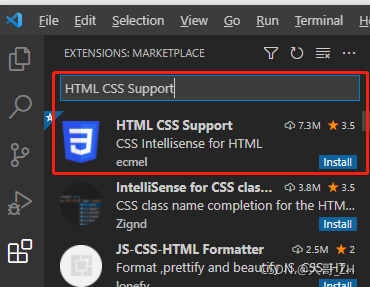

## 14.Volar

随着 Vue3 正式版发布，Vue 团队官方推荐 Volar 插件来代替 Vetur 插件，不仅支持 Vue3 语言高亮、语法检测，还支持 TypeScript 和基于 vue-tsc 的类型检查功能。

## 15.Vue Peek

vue组件跳转
