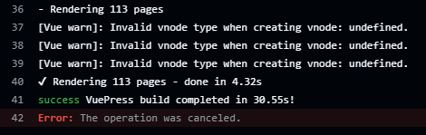
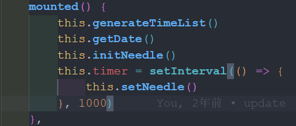

# 用vuepress-theme-reco2搭建博客时遇到的一些坑
## 1

之前github自动部署失败了，一直没管，最近想起来修改，查看git actions报错日志，发现执行到pnpm run build成功之后就没有退出，导致无法执行下一步。

最终发现是clock.vue这个组件的原因
因为vuepress是服务端渲染的，不能在created使用setInterval之类的定时器。

把定时器放到mounted里面就可以了

## 2

vuepress-theme-reco2经常更新，每次更新就会有配置项的改变，但是官网的文档又只列举了最新的配置项，导致想要修改之前的配置项时无从下手，只能被迫更新到最新的版本，需要重新去查看文档修改配置。

## 3

主题默认把`.vuepress/components`下的组件自动注册为全局组件，如果是多层目录下的组件，调用时需在组件名前加上`目录名-`，这是在文档上没有说明的。

## 4

运行`pnpm run dev`后，浏览器时常会报`Error: useClientData() is called without provider.`的错误，删掉`.vuepress/.cache`重启项目即可解决。

## 5

开启`autoSetSeries: true`之后，放在series文件夹下的md文件按文件夹会自动设置成系列，但是没有系列名，为了能够更加个性化，还是在series配置项下单独设置系列。

## 6

在本地运行`pnpm run build`报错

```shell
error node_modules/.pnpm/@vuepress+plugin-search@2.0_a7b013fb960bf20191eebb12f36855dc/node_modules/@vuepress/plugin-search/lib/client/index.js (4:9): "SEARCH_INDEX" is not exported by ".vuepress/.temp/internal/searchIndex.js", imported by "node_modules/.pnpm/@vuepress+plugin-search@2.0_a7b013fb960bf20191eebb12f36855dc/node_modules/@vuepress/plugin-search/lib/client/index.js".
file: D:/czj/project/blog/node_modules/.pnpm/@vuepress+plugin-search@2.0_a7b013fb960bf20191eebb12f36855dc/node_modules/@vuepress/plugin-search/lib/client/index.js:4:9
```

删掉`.vuepress/.temp`重新运行`pnpm run build`即可解决。

## 7

页面在开发环境中报错`Maximum call stack size exceeded`，排查发现是因为md文件名为`clock`，和页面中引用的组件名字`clock`冲突了
  
解决办法是改名或者修改组件名。
