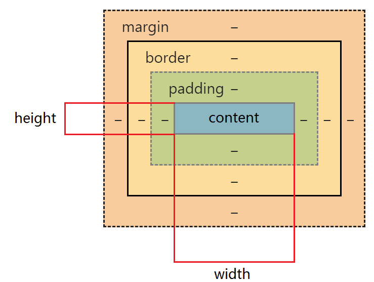
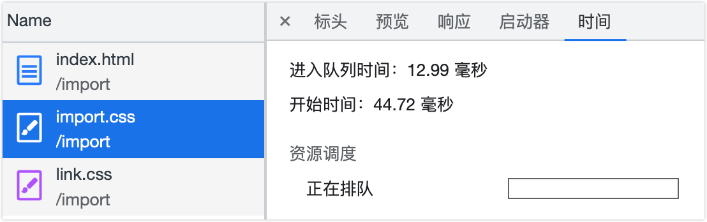

## 介绍一下盒模型

<custom-block title="什么是盒模型？" content="<div>当对一个文档进行布局时，浏览器的渲染引擎会根据标准之一的 <strong><code>CSS</code> 基础框盒模型</strong>（CSS basic box model），将所有元素表示为一个个矩形的盒子；<code>CSS</code> 决定这些盒子的大小、位置以及属性（如颜色、背景、边框尺寸等）</div><div>每个盒子（即盒模型）从外到内由这四个部分组成</div><ul><li><code>margin</code> 外边距（不计入盒子的实际大小）</li><li><code>border</code> 边框</li><li><code>padding</code> 内边距</li><li><code>content</code> 内容</li></ul><div><a href='https://developer.mozilla.org/zh-CN/docs/Web/CSS/CSS_Box_Model/Introduction_to_the_CSS_box_model' target='_blank'>CSS 基础框盒模型介绍 - CSS：层叠样式表 | MDN</a></div>"></custom-block>

盒模型分为 **`W3C` 标准盒模型**和 **`IE` 盒模型**，其区别只有一个：**计算盒子实际大小（即总宽度/总高度）的方式不一样**

- `W3C` 标准盒模型（默认）
  - **盒子实际宽 = `width` + `padding` + `border`**
  - 其中 **`width` 只包含 `content`**（即内容区域的宽度）
  - **通过 `box-sizing: content-box;` 来设置为 `W3C` 标准盒模型**
- IE 盒模型
  - **盒子实际宽 = `width`**
  - 其中 **`width` = `content` + `border` + `padding`**
  - **通过 `box-sizing: border-box;` 来设置为 `IE` 盒模型**

| W3C 标准盒模型       | IE 盒模型            |
| -------------------- | -------------------- |
|  |  |

## 什么是BFC?

先了解一些前置知识：格式化上下文（Formatting Context）
<custom-block title="前置知识：格式化上下文（Formatting Context）" content="<div>格式化上下文（Formatting Context）即 <code>FC</code>，<strong>是 <code>Web</code> 页面中一种特殊的渲染区域，并有一套渲染规则，它决定了其元素如何排列、定位，以及和其他元素的关系和相互作用</strong></div><div>在 <code>CSS</code> 中，每个元素都属于一个特定的格式化上下文。有一些元素自带格式化上下文，例如根元素（<code>html</code>）、块级元素、浮动元素、绝对定位元素等。其他元素则可以通过一些 <code>CSS</code> 属性来创建自己的格式化上下文，例如 <code>display: inline-block</code>、<code>overflow: hidden</code>、<code>float: left</code> 等。</div>"></custom-block>

相关资料

- [Introduction to formatting contexts 格式化上下文简介 - CSS：层叠样式表 | MDN](https://developer.mozilla.org/zh-CN/docs/Web/CSS/CSS_Flow_Layout/Intro_to_formatting_contexts)
- [块格式化上下文 | MDN](https://developer.mozilla.org/zh-CN/docs/orphaned/Web/Guide/CSS/Block_formatting_context)
- [Block formatting contexts | W3C CSS2.1](https://www.w3.org/TR/CSS2/visuren.html#block-formatting)

`BFC` 即块级格式化上下文（Block Formatting Context），是 `Web` 页面中一种渲染模式，用于确定块级元素如何排列、定位和与其他元素交互，其相当于一个独立的容器，里面的元素和外部的元素相互不影响

### `BFC` 的布局规则

- `BFC` 内部的 `Box` 会在垂直方向，一个接一个的放置（**不会出现元素重叠**）
- `BFC` 中两个 `Box` 垂直方向的距离由 `margin` 决定
- **同一个 `BFC` 中两个相邻 `Box` 的垂直边距 margin 会发生重叠**，在不同的 `BFC` 中则不会发生重叠
- `BFC` 中每个子元素的左外边距（`margin-left`）与容器父元素的左边界相接触（`border-left`）
- `BFC` 中元素的布局不受外界的影响，也不会影响到外界的元素
  - 形成了 `BFC` 的区域**不会与浮动元素区域重叠**
  - **计算 `BFC` 的高度时，浮动元素也会参与计算**

### `BFC` 如何创建

- 根元素（`<html>`）
- 浮动元素：`float` 不为 `none`
- 绝对定位元素：`position` 为 `absolute` 或 `fixed`
- `display` 值为如下属性
  - `inline-block` 行内块元素
  - `flow-root` 块级元素盒
  - `table` 该行为类似于 `<table>` 元素
  - `table-cell` 该行为类似于 `<td>` 元素
  - `table-caption` 该行为类似于 `<caption>`
  - `table-row` 该行为类似于 `<tr>` 元素
  - `table-row-group` 该行为类似于 `<tbody>` 元素
  - `table-header-group` 该行为类似于 `<thead>` 元素
  - `table-footer-group` 该行为类似于 `<tfoot>` 元素
  - `inline-table` 内联表格
- `display` 值为 `flex` `inline-flex` `grid` `inline-grid` 的直接子元素，且它们本身都不是 `flex`、`grid`、 `table` 容器
- `contain` 值为 `layout`、`content` 或 `paint` 的元素
- `overflow` 不为 `visible` 和 `clip` 的块元素
- 多列容器：`column-count` 或 `column-width` 值不为 `auto`
- `column-span` 值为 `all`

### `BFC` 的应用场景

解决了什么问题

- 浮动元素高度塌陷
- 阻止元素被浮动元素覆盖
- 防止 `margin` 重叠（塌陷）
- 自适应布局

### 常见的格式化上下文总结

- `BFC`：块级格式化上下文（Block Formatting Context）
- `IFC`：行内格式化上下文（Inline Formatting Context）在 `IFC` 中元素会沿着基线对齐并按从左到右的顺序排列
- `TCFC`：表格单元格格式化上下文（Table Cell Formatting Context）在 `TCFC` 中表格的列宽会根据单元格的内容自动调整，而不会出现列宽不一致的情况
- `FFC`：弹性盒子格式化上下文（Flexbox Formatting Context）在 `FFC` 中弹性盒子元素可以按照自己的尺寸和顺序进行排列。
- `GFC`：网格格式化上下文（Grid Formatting Context）在 `GFC` 中网格元素可以按照网格的行和列进行排列
  `FFC` 和 `GFC` 除布局之外规则与 `BFC` 块格式上下文类似，其容器中不存在浮动子元素，但排除外部浮动和阻止外边距重叠仍然有效

## 伪选择器（伪元素和伪类）

伪选择器包含**伪元素**和**伪类**，其都是添加到一个选择器末尾的关键字

### 伪元素

伪元素即伪元素选择器，**是通过元素内部创造假的元素**，其不能匹配任何真实存在的 `html` 元素，使用双冒号（`::`）语法
<custom-block title="常用的伪元素选择器" content="<ul><li><a href='https://developer.mozilla.org/zh-CN/docs/Web/CSS/::before' target='_blank'><code>::before</code></a> 在选定元素的第一个子元素前插入内容</li><li><a href='https://developer.mozilla.org/zh-CN/docs/Web/CSS/::after' target='_blank'><code>::after</code></a> 在选定元素的最后一个子元素后插入内容 <ul><li>都默认为行内元素</li><li>都需要 <a href='https://developer.mozilla.org/zh-CN/docs/Web/CSS/content' target='_blank'><code>content</code></a> 属性配合（用于指定要插入的内容）</li><li>都不能应用在替换元素上， 比如 <code>&lt;img /&gt;</code> 或 <code>&lt;br /&gt;</code> 元素</li></ul></li><li><a href='https://developer.mozilla.org/zh-CN/docs/Web/CSS/::first-line' target='_blank'><code>::first-line</code></a> 为块级元素第一行指定样式 <ul><li>只能在块元素中使用（即 <code>display</code> 属性为这些值： <code>block</code>、<code>inline-block</code>、<code>table-cell</code>、<code>list-item</code> 或 <code>table-caption</code>）</li></ul></li><li><a href='https://developer.mozilla.org/zh-CN/docs/Web/CSS/::first-letter' target='_blank'><code>::first-letter</code></a> 为块级元素第一行的第一个字符指定样式 <ul><li>只能在块元素中使用（同 <code>::first-line</code>）</li></ul></li><li><a href='https://developer.mozilla.org/zh-CN/docs/Web/CSS/::selection' target='_blank'><code>::selection</code></a> 为文档中被用户选中或处于高亮状态的部分指定样式 <ul><li>仅这些样式可用：<code>color</code>、<code>background-color</code>、<code>cursor</code>、<code>caret-color</code>、<code>outline</code>、<code>text-decoration</code>、<code>text-emphasis-color</code>、<code>text-shadow</code></li></ul></li><li><a href='https://developer.mozilla.org/zh-CN/docs/Web/CSS/::placeholder' target='_blank'><code>::placeholder</code></a> 为一个表单元素的占位文本指定样式</li></ul>"></custom-block>

### 伪类

伪类即伪类选择器，**表示元素的某种状态**，使用单冒号（`:`）语法
推荐阅读[张鑫旭的《CSS 选择器世界》](https://book.douban.com/subject/34846688/)

## 实现垂直水平居中

### `text-align` + `line-height`

只能在行内内容在一行时使用（换行了就 GG），同时还需要知道高度的具体值

```css
.parent {
  height: 150px;
  /* 行高的值要与 height 一致 */
  line-height: 150px;
  text-align: center;
}
.child {
  /* 如果子元素是块级元素需要改为行内或行内块级才能生效 */
  display: inline-block;
  vertical-align: middle;
}
```

### `absolute + transform`

```css
.parent {
  position: relative;
}
.child {
  position: absolute;
  left: 50%;
  top: 50%;
  tansform: translate(-50%, -50%);
}
```

### `display: table-cell`

```css
.parent {
  display: table-cell;
  vertical-align: middle;
  text-align: center;
}
```

### `flex`

```css
.parent {
  display: flex;
  justify-content: center;
  align-items: center;
}
```

### `flex + margin`

```css
.parent {
  display: flex;
}
.child {
  margin: auto;
}
```

### `grid`

```css
.parent {
  display: grid;
}
.child {
  justify-self: center;
  align-self: center;
}
```

### `grid + margin`

```css
.parent {
  display: grid;
}
.child {
  margin: auto;
}
```

## `flex: 1` 代表什么？

[`flex`](https://developer.mozilla.org/zh-CN/docs/Web/CSS/flex) 是一个 `CSS` 简写属性，用于设置 `Flex` 项目如何增大或缩小以适应其 `Flex` 容器中可用的空间
<custom-block title="flex 是 flex-grow flex-shrink flex-basis 属性的简写" content="<ul><li><a href='https://developer.mozilla.org/zh-CN/docs/Web/CSS/flex-grow' target='_blank'>flex-grow</a> 用于<strong>设置 <code>flex</code> 项目的增长系数</strong><ul><li>负值无效</li><li>初始值为 <code>0</code></li><li>省略时默认值为 <code>1</code></li></ul></li><li><a href='https://developer.mozilla.org/zh-CN/docs/Web/CSS/flex-shrink' target='_blank'>flex-shrink</a> 用于<strong>设置 <code>flex</code> 项目的收缩系数</strong>（仅在默认 <code>width/height</code> 之和大于容器时生效） <ul><li>负值无效</li><li>初始值为 <code>1</code></li><li>省略时默认值为 <code>1</code></li></ul></li><li><a href='https://developer.mozilla.org/zh-CN/docs/Web/CSS/flex-basis' target='_blank'>flex-basis</a> 用于<strong>设置 <code>flex</code> 项目在主轴方向上的初始大小</strong><ul><li>初始值为 <code>auto</code></li><li>省略时默认值为 <code>0</code></li></ul></li></ul>"></custom-block>

### `flex` 缩写语法规则

### 单值语法规则

```css
/* 全局属性值 */
/* 初始值 */
flex: initial; => flex: 0 1 auto
/* 从其父级继承 (flex 属性不可被继承，将设置为初始值) */
flex: inherit; => flex: 0 1 auto
/* 是关键字 initial 和 inherit 的组合(当属性可继承时为 inherit 不可继承时为 initial) */
flex: unset; => flex: 0 1 auto


/* 关键字值 */
/* 根据自身的宽度与高度来确定尺寸 弹性 */
flex: auto; => flex: 1 1 auto
/* 根据自身宽高来设置尺寸 非弹性 */
flex: none; => flex: 0 0 auto


/* 无单位数: flex-grow（标题答案）*/
flex: 1; => 1 1 0
flex: 0; => 0 1 0


/* 一个有效的 width/height 值: flex-basis */
flex: 10px; => 1 1 10px
flex: 20em; => 1 1 20em
flex: min-content; => 1 1 min-content
```

### 双值语法规则

1. **第一个值必须为一个无单位数**
2. 第二个值必须为以下之一
   1. **无单位数**：当作 `flex-shrink` 值
   2. **有效的 `width/height` 值**：当作 `flex-basis` 值

```css
/* 无单位数: flex-grow | flex-shrink */
flex: 2 2; => 2 2 0

/* 有效的 width/height 值: flex-grow | flex-basis */
flex: 2 30px; => 2 1 30px
```

### 三值语法规则

1. **第一个值必须为一个无单位数**，当作 `flex-grow` 值
2. **第二个值必须为一个无单位数**，当作 `flex-shrink` 值
3. **第三个值必须为一个有效的 `width/height` 值**，当作 `flex-basis` 值

```css
flex: 2 2 10%;
```

[`Flex` 语法和计算规则](https://github.com/maomao1996/daily-notes/issues/23)

## `link` 和 `@import` 加载样式的区别

[<link>](https://developer.mozilla.org/zh-CN/docs/Web/HTML/Element/link) 是一个 `HTML` 标签，其规定了当前文档与外部资源的关系
[@import](https://developer.mozilla.org/zh-CN/docs/Web/CSS/@import) 是一个 `CSS` 语法规则，用于从其他样式表导入样式规则
<custom-block title="link 和 @import 加载样式的区别" content="<ul><li>从属关系 <ul><li><code>&lt;link&gt;</code> 是一个 <code>HTML</code> 标签，只能出现在 <code>&lt;head&gt;</code> 标签中</li><li><code>@import</code> 是一个 <code>CSS</code> 语法规则，只能在 <code>&lt;style&gt;</code> 标签和 <code>CSS</code> 文件中使用</li></ul></li><li>应用范围 <ul><li><code>&lt;link&gt;</code> 标签用于链接各种类型的外部资源（这里只举三个 🌰） <ul><li>加载 <code>CSS</code>：<code>&lt;link rel='stylesheet' href='/index.css' /&gt;</code></li><li>加载网站图标（<code>favicon</code>）：<code>&lt;link rel='icon' href='favicon.ico' /&gt;</code></li><li><code>DNS</code> 预解析：<code>&lt;link rel='dns-prefetch' href='https://notes.fe-mm.com'&gt;</code></li></ul></li><li><code>@import</code> 只能用于引入 <code>CSS</code></li></ul></li><li>加载顺序 <ul><li><code>&lt;link&gt;</code> 会在浏览器加载页面时同时加载（多个 <code>&lt;link&gt;</code> 会并行加载）</li><li><code>@import</code> 会在浏览器解析到 <code>CSS</code> 中的 <code>@import</code> 时再加载（多个 <code>@import</code> 会串行加载）</li></ul></li><li><code>DOM</code> 可控性 <ul><li><code>&lt;link&gt;</code> 可以通过 <code>JavaScript</code> 操作 <code>DOM</code> 进行插入</li><li><code>@import</code> 没有 <code>DOM</code> 接口，无法通过 <code>JavaScript</code> 操作</li></ul></li></ul>"></custom-block>

关于 @import 的加载顺序\
网上很多文章都说 `@import` 引入的 `CSS` 将在页面加载完毕后被加载，其实这个说法是有问题的，比如下面这段代码，我在 `style` 标签里面使用的 `@import`，难道还要在页面加载完毕后再去加载

```html
<!DOCTYPE html>
<html>
  <head>
    <title>关于 @import 的加载顺序</title>
    <!-- 在 style 中使用 import 引入 css -->
    <style>
      @import url(./import.css);
    </style>
    <!-- 使用 link 引入 css -->
    <link href="./link.css" rel="stylesheet" />
  </head>
  <body>
    关于 @import 的加载顺序
  </body>
</html>
```

然后打开浏览器 `network` 面板去查看具体资源的加载时间

`import.css` 排队时间

`link.css` 排队时间

所以 `@import` 的加载顺序要看其写在哪里，而不能一概而论
