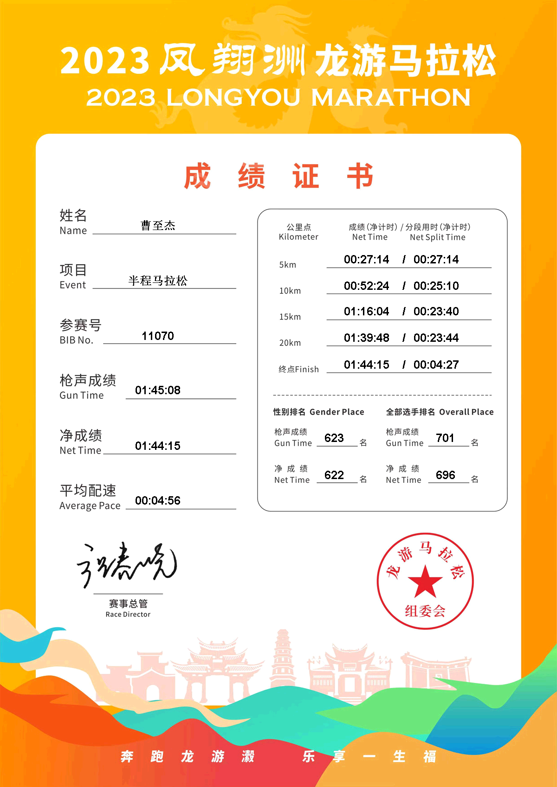

# 2023龙游马拉松

4月8号得知龙游将举办马拉松，由于在浙江省内也还算近，于是立马报名了一个半马。其实内心还是有点虚，因为自从新冠阳性之后就没怎么跑了，停跑了好几个月，直到三月份才慢慢恢复跑量，此时对于半马跑进2小时都还没信心。

## 4月20日

通知全马项目取消，由于高温的原因，庆幸自己报名的是半马。

## 4月30日

早上8点，从余杭五常地铁站乘坐5号线到杭州城站，9点到达城站，10:30乘坐火车前往龙游，到达龙游站已是下午2点，乘坐将近4个小时的绿皮火车真的是难受...座位很挤，还是硬座。达到了龙游火车站之后便乘坐公交直接前往了旅馆，在旅馆稍作休息之后前往龙游博物馆领取参赛包，参赛包里有一次性雨衣，号码簿，我的号码是11070，几张景点5折优惠券，赛事手册，交通告知书，一件速干衣。更让我惊喜的是，主办方还专门为马拉松参赛者安排了免费的接驳公交，这一点必须点个赞，感觉超贴心！

## 4月31日
清晨5点，闹钟一响，我便麻溜地起床，搭上公交车直奔起跑点。6点抵达时，现场人还不算多，我便趁着这会儿功夫做了会儿热身。等到了集合点，好家伙，前面已经乌泱乌泱聚集了好几百人，想往前挤挤都费劲，只能乖乖在那等着起跑。  
7点整，比赛正式开跑！因为我站的位置不在最前头，等我跑到起跑拱门时，都过去50秒了。不过好在这次成绩有净成绩一说，所以这几秒我也就没太放在心上。这次我的目标很明确，就是跑进1小时52分，达到我这个年龄段浙马一级的标准。其实，在这个时间范围内完成半马，我就成功过一次，还是阳之前的事儿了，所以心里一直没啥底气。

我原本的计划是，刚开始先用5分半的配速跑上5公里，先试试感觉。要是跑着轻松，那就加速；要是感觉吃力，就保持这个速度，能进2小时就行。结果刚开始一公里，根本冲不起来，前面全是人堵着，第一公里我用了5分26秒，还算在计划之内。到第二公里时，我才稍微提了点速，用时5分13秒，这时候感觉还挺轻松的。参加比赛和平时自己跑就是不一样，明显轻松不少。慢慢地，我跑到了5公里的第一个补给点，前5公里我一共用了26分17秒。要是按照这个速度跑下去，全程大概1小时50分钟左右，达到目标应该没问题。所以到了补给点，我啥都没拿，接着往前跑。

跑到10公里时，用时51分22秒。在补给点，我拿了杯东鹏特饮。这时候我的体能还很充沛，而且感觉越跑越带劲。不过，我还是得吐槽一句，这赛道的坡也太多了，严重影响了我的节奏。

到了15公里处，我惊讶地发现，近5公里我居然只用了23分30秒，这比我预想的快太多了。我心里暗喜，这次肯定能进1小时45分了。15公里之后，赛道上逐渐有人开始走路了。这时候，基本没人能超过我，都是我在追着别人跑。15 - 25公里这一段，我用时23分45秒，也比计划快了不少。我看到145兔子就在前面不远处，这时候我感觉有点累了，但还是咬咬牙，拼尽全力追了上去。追上之后，可能因为刚刚提速太猛，肚子开始疼起来，呼吸也变得急促，那滋味别提多难受了。

终于跑到终点，我发现手表显示的距离比半马多了100米，拱门显示的时间超过了1小时45分。不过我心里有数，我的净成绩肯定在1小时45分之内，因为145兔子还在我后面呢，所以我也算达到了让自己满意的成绩。

最后一看手表记录的时间，半马成绩是1:43:48，成功PB（个人最好成绩）！而且10 - 20公里这一段，我用时47分9秒，10公里也PB了！
## 最后附上完赛证书

<!-- ### 总消费
半程报名费：120
火车票：杭州-龙游 40  龙游-桐乡 118
旅馆：72
饮食：25
交通费：8
---------------
总消费：￥383 -->
