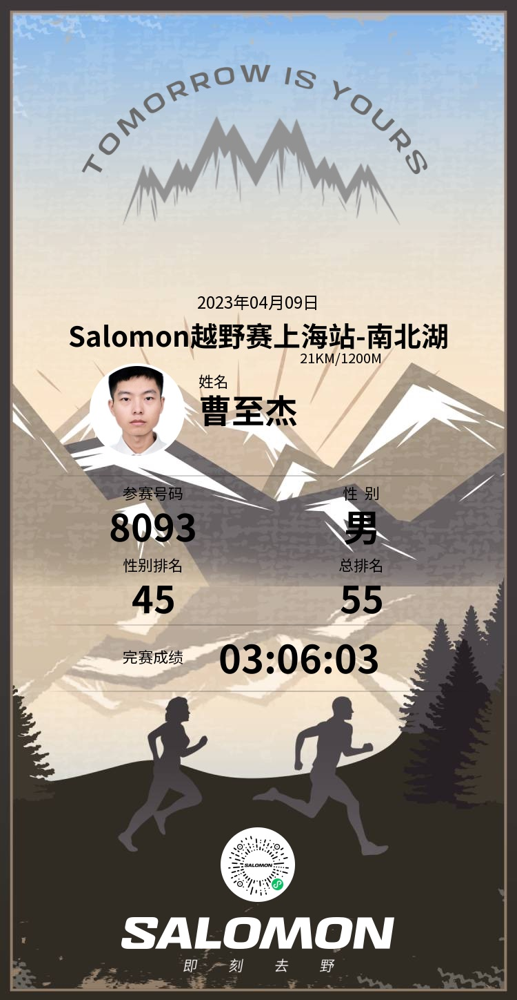

# salomon409南北湖越野跑

首次跑越野赛，地点也不是很远，就是在嘉兴本市的最高峰--高阳山，早上10点起跑，气温20℃，属于很舒适的温度。跑前几天在杭州爬了一天的山还没有完全恢复，刚出发2公里腿就开始酸了，一直忍着。15公里时感觉没力气了，腿也隐隐约约有抽筋的前兆，17公里时是鹰窠顶下山，腿一用力突然抽筋，瞬间摔倒痛的站不起来，好在有位大佬停下来帮我拉伸，花了5分钟抽筋缓解后，我才慢慢地往山下走去。好在最后3公里是绕着南北湖的水泥公路，我就尽可能快得走，中途有10来个人超过我。  
最后用时3小时06分，排名53，要是腿不抽筋是能进3小时的。不过这次比赛作为我的第一次越野赛还是非常开心的，感受了越野赛的氛围。

### 最后附上完赛证书

