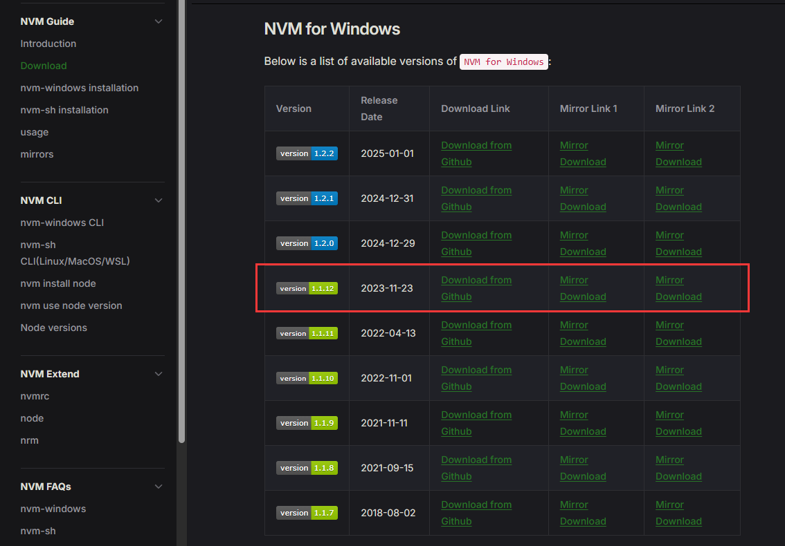
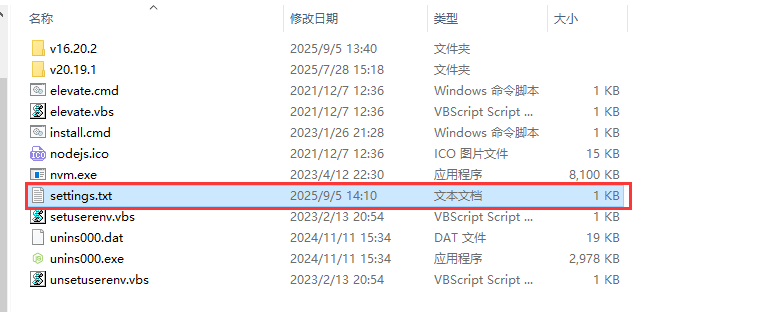

# 前端开发环境配置

每次更换电脑都要重新配置开发环境，记录一下常用工具的安装步骤。

## 1. VS Code

### 安装

[Visual Studio Code](https://code.visualstudio.com/Download) 官网进行下载安装

### 常用插件推荐

[vscode 常用插件推荐](/blogs/vscode/)

## 2.Git

使用`sourcetree`可视化工具进行 git 操作

### 安装

[sourcetree](https://www.sourcetreeapp.com/) 官网进行下载安装  
git 包含在内，无需单独安装

## 3.node

使用`nvm`进行 node 版本管理，`nvm` 可以管理多个 node 版本，可以方便快捷的 安装、切换 不同版本的 node。

### 安装 nvm

[下载地址](https://www.nvmnode.com/guide/download.html)  


安装完成后，找到安装目录下的`settings.txt`文件

把以下配置复制进去

```
root: D:\nvm
path: D:\node

arch: x64

node_mirror: https://npmmirror.com/mirrors/node/
npm_mirror: https://npmmirror.com/mirrors/npm/
```

::: tip
`root`是 nvm 的安装目录  
`path`是 node 的快捷路径，当切换 node 版本时，path 的路径指向的都是当前的 node。  
nvm 安装后会自动配置好环境变量，无需手动配置。  
:::

### nvm 常用命令

```bash
nvm install <version> #命令安装指定的node版本
nvm install --lts     #安装最新的LTS版本
nvm list              #查看所有已安装的node版本
nvm use <version>     #切换到指定版本的node
```

### 安装 pnpm

推荐使用`pnpm`作为包管理工具，相比于 npm 和 yarn，它具有更快的安装速度和更好的依赖管理。  
安装：`npm install -g pnpm`，会安装在当前 node 版本下的 node_modules 目录下
