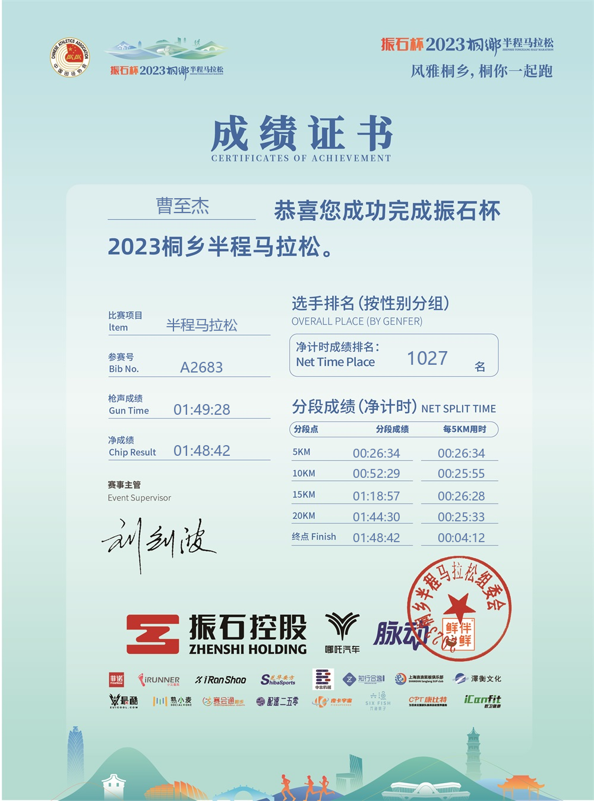

# 2023桐乡半程马拉松

这场比赛是家门口的马拉松，也是我参加的第一场线下桐乡半程马拉松。

"振石杯"2023桐乡半程马拉松以"风雅桐乡"为主题，设半程马拉松（21.0975 公里）和迷你跑（约 3.5 公里）两个组别，吸引了国内外 6000 多名选手参与。今年是桐马首次完成中国田协认证、晋升为 A1 类赛事，意义非凡。作为桐乡本地人，家门口办这么大的比赛，没有不报名的道理。

## 赛前

比赛前一周，我不幸感染了新冠。烧退了之后人还是虚，跑两步就喘，心里一度打起了退堂鼓。但想想这是家门口的首届 A1 类赛事，又舍不得放弃，最后还是决定：去！不拼成绩，安全完赛就行。

赛前给自己定的策略很明确：稳着 5 分 12 秒的配速跑，对应半马 1 小时 50 分。这个配速比我平时的 PB 配速慢了不少，但新冠初愈，不敢逞强。

## 比赛日

12 月 3 日早上 7:30，发令枪响，比赛从桐乡市全民健身中心暨李宁体育园正式开跑。初冬的早晨还是很冷的，但阳光不错，是个适合跑步的好天气。

起跑后我就按计划压住配速，5 分 12 秒左右，不跟任何人比。前 10 公里跑得还算轻松，虽然新冠过后肺活量明显不如从前，但配速稳住了，呼吸也还均匀。沿途市民热情得很，每隔几百米就有加油助威的人群，氛围拉满。

过了 15 公里，疲态开始显现。不是腿酸，是那种从骨子里透出来的累——新冠的后劲确实大，心率比平时同配速高了 10 多拍。好几次想提速都被自己压了下来，咬着牙继续按 5 分 12 秒的配速往前挪。

最后 2 公里，终点就在前方，观众的加油声越来越密。我试着提了点速，但腿实在不听使唤，只能维持原配速冲过终点。看了眼手表，1 小时 48 分出头，和赛前计划基本一致。

## 赛后

冲线后领了完赛奖牌和补给，整个人像被抽空了一样。这场比赛跑得很累，成绩也远不如平时，但能在家门口、在新冠初愈后安全完赛，已经很知足了。

期待明年桐马再战，到时候一定跑出个像样的成绩。

## 最后附上完赛证书

