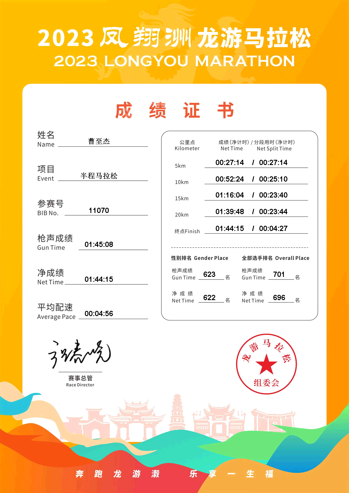

# 2023龙游马拉松

4月8号刷到龙游要办马拉松的消息，一看在浙江省内、距离也不算远，我二话没说就报了半马。其实报名时心里挺没底的——自从去年底新冠阳了之后，我停跑了好几个月，直到三月份才慢慢把跑量捡回来，那会儿对半马能不能破 2 小时都没信心。

## 4月20日

组委会发通知，因高温天气，全马项目取消。暗自庆幸自己报的是半马。

## 4月30日

早上 8 点从余杭五常地铁站出发，坐 5 号线到杭州城站，9 点到站，10:30 登上开往龙游的火车。抵达龙游站已是下午 2 点——将近 4 个小时的绿皮硬座，座位又挤，一路下来确实难受。出站后直接坐公交前往旅馆，稍作休息便去龙游博物馆领取参赛包：一次性雨衣、号码簿（我的号码是 11070）、几张景点 5 折优惠券、赛事手册、交通告知书，还有一件速干衣。更让我惊喜的是，主办方还专门为参赛者安排了免费接驳公交，这一点必须点个赞，超贴心！

## 5月1日

清晨 5 点闹钟一响，我便麻溜地起床，搭上公交直奔起点。6 点抵达时，现场人还不算多，我趁机做了会儿热身。等挪到集合区一看，好家伙，前面已经乌泱泱挤了好几百人，想往前凑都费劲，只好乖乖在原地等着起跑。

7 点整，比赛正式开跑！我站的位置不在最前排，等迈过起点拱门时，枪声已经响过 50 秒了。好在成绩按净计时算，这几秒我也就没太放在心上。这次目标很明确：跑进 1 小时 52 分，达到我这个年龄段的浙马一级标准。而这个成绩，我阳之前也只跑出过一次，所以心里一直没什么底气。

我原本的计划是，先按 5 分半的配速跑 5 公里找找感觉：跑着轻松就加点速，感觉吃力就稳住节奏，能进 2 小时就行。结果第一公里根本冲不起来——前面全是人堵着，只能跟着挪，5 分 26 秒完事，倒也在计划之内。第二公里稍微提了点速，用时 5 分 13 秒，这时候身子已经跑开了。不得不说，参加比赛和平时自己单练就是不一样，有氛围加持，明显轻松不少。就这么一路到 5 公里补给点，前 5 公里一共用时 26 分 17 秒。照这个速度推下去，全程大概 1 小时 50 分，达成目标应该没问题，于是我补给点什么都没拿，接着往前跑。

跑到 10 公里，用时 51 分 22 秒。在补给点拿了杯东鹏特饮。这时候体能依旧充沛，甚至感觉越跑越带劲。不过还是得吐槽一句：这赛道的坡是真多，节奏一次次被打断。

到 15 公里处一看表，近 5 公里居然只用了 23 分 30 秒，比预想的快了一大截，心里暗喜：这次 145 稳了。15 公里之后，赛道上陆续有人开始走路，而我这边基本没人能超过我，都是我在追着别人跑。15 到 20 公里这一段，用时 23 分 45 秒，也比计划快了不少。抬头一看，145 兔子就在前面不远处。这时候我已经有点累了，但还是咬咬牙，拼尽全力追了上去。刚追上，或许是刚才提速太猛，肚子一阵绞痛，呼吸也跟着急促起来，那滋味别提多难受。

终于熬到终点。手表显示的距离比半马多了 100 米，拱门上的枪声时间也超过了 1 小时 45 分。不过我心里有数：净成绩肯定在 145 以内，毕竟 145 兔子还在我后面呢。这个成绩，足够让自己满意了。

最后核对手表记录：半马成绩 1:43:48，成功 PB（个人最好成绩）！而且 10 到 20 公里这一段只用了 47 分 9 秒，10 公里也顺带 PB 了！

## 最后附上完赛证书

<!-- ### 总消费
半程报名费：120
火车票：杭州-龙游 40  龙游-桐乡 118
旅馆：72
饮食：25
交通费：8
---------------
总消费：￥383 -->
