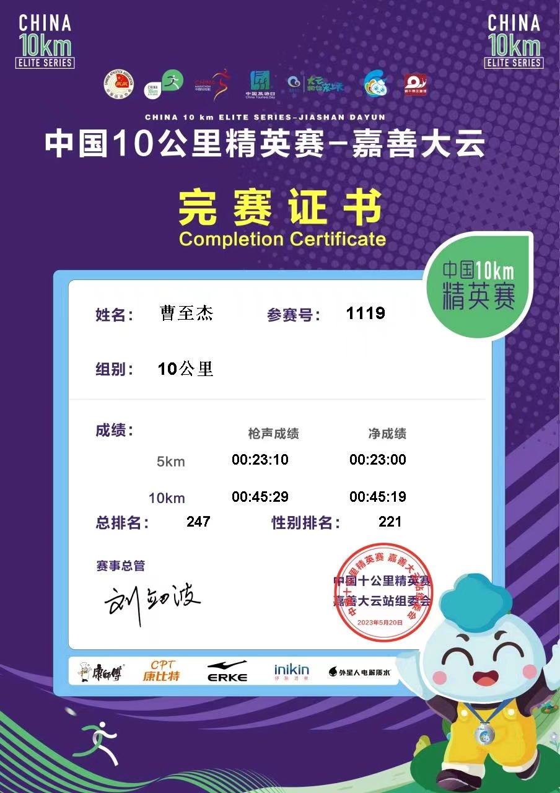

# 2023嘉善大云中国10公里精英赛

2023 年 5 月 20 日，中国 10 公里精英赛长三角首站在嘉善大云鸣枪开跑。这是中国田协认证的赛事，成绩达标后可以申请大众选手等级证书，我自然也报了名。出发前给自己定的目标不高：跑进 52 分、达标大众二级就行。一来一周前刚比完无锡惠山越野赛，腿抽筋抽得厉害，估计还没完全恢复；二来 42 分到 52 分都算大众二级，而我眼下也没有跑进 42 分的实力，不如稳一点。

本次比赛共 2000 多人参加，早上 8 点鸣枪。最前面是精英选手，大众选手紧随其后，亲子跑方阵压在最后。发令枪一响我就直接冲了出去，跑到 200 米瞥了眼手表——4 分 10 秒的配速，我知道这速度根本坚持不住，果断把配速压到 4 分 30 秒，第一公里用时 4 分 28 秒。第 2 到 8 公里，我一直稳在 4 分 33 秒左右的配速。这个强度下心率飙得很高，冲到了 185，不过呼吸倒还平缓，能咬住。最后 1 公里咬牙冲了一波，单公里 4 分 7 秒。最终，45 分 19 秒冲过终点线。

这场比赛开心地 PB 了 1 分 41 秒。不过我心里清楚，这是拼尽全力才跑出来的成绩，想再往上走，还得靠平时堆训练量。这也是我上半年的最后一场比赛，下一场估计要等到 5 个月后的 10 月份了。这 5 个月里好好练，下半年的目标是：半马破 140、10 公里破 45 分、5 公里跑进 22 分，再争取把人生首个全马跑下来。

## 最后附上完赛证书

