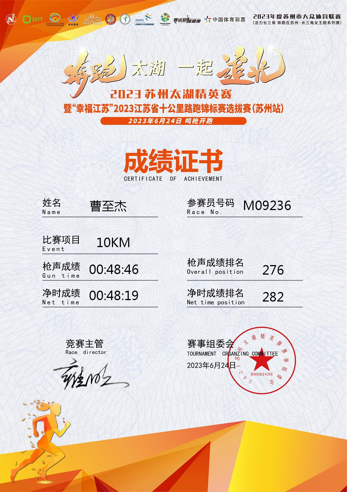

# 2023江苏太湖精英赛

雨战！上半年最后一场比赛。

这场比赛的全名很长——2023苏州太湖精英赛暨"幸福江苏"2023年江苏省十公里路跑锦标赛选拔赛（苏州站），设男子、女子个人 10 公里两个组别，规模 3000 人，报名费 100 元。之所以报名，一来是 10 公里距离刚好，二来苏州离嘉兴不远，高铁半个多小时就到，当作上半年的收官之战再合适不过。

## 6月23日

中午从桐乡站乘高铁前往苏州站。出站时天就阴沉沉的，打车去酒店的路上雨开始下，到了晚上越下越大。心里不由得咯噔一下——明天比赛怕是要淋雨了。

## 6月24日

早上 7:30 鸣枪，地点在苏州马山游客中心。6 点不到就起了床，窗外雨还在下，而且完全没有要停的意思。简单吃了点东西，换上装备乘坐有轨电车直奔起点。

到了起点一看，雨势丝毫未减，3000 名选手挤在拱门下，雨衣、雨伞、各色冲锋衣混在一起，场面倒也壮观。既然是雨战，也就没什么好纠结的了，脱了外套存包，穿一次性雨衣，但由于风太大，雨衣直接被吹破了，索性扔了。

枪响出发。赛道沿着太湖铺开，途经马山游客中心、杵山体育公园、西京湾花海、西京湾艺术中心等环太湖核心区域，路面宽阔平坦，本是一条不错的赛道，可惜被这场大雨打了折扣。雨水顺着帽檐往下淌，眼镜片上全是水珠，跑两步就得抬手擦一下。脚下也打滑，每一步都得格外小心，生怕踩到积水溅一身。

冲线后领了完赛包和奖牌，由于这次比赛是QueenRun系列赛，所以每个完赛选手都赠送了一束仿真玫瑰花。

到此，上半年的比赛全部结束，下一场得等到下半年了。趁着这段时间好好堆训练量，下半年再冲一波 PB。

## 最后附上完赛证书

