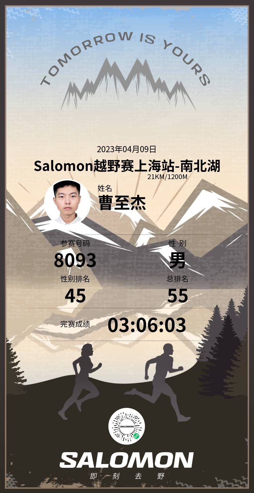

# salomon409南北湖越野跑

人生第一场越野赛，地点就在嘉兴本市的最高峰——高阳山，不算远，心里没什么压力。早上 10 点起跑，气温 20℃，很舒服的跑步温度。

不过状态并不理想。跑前几天在杭州爬了一天的山，腿还没完全恢复过来。刚出发 2 公里，大腿就开始发酸，只能一直忍着往前挪。

## 比赛过程

前半程还算顶得住，咬着牙熬过了爬升段。到了 15 公里，力气明显见底，腿也开始隐隐有抽筋的前兆。我心里清楚，最难的部分还没来——17 公里处是鹰窠顶下山，坡陡路滑，腿一用力，小腿瞬间抽筋，整个人直接摔在地上，痛得站不起来。好在有位大佬经过，二话不说停下来帮我拉伸，花了大概 10 分钟，抽筋才慢慢缓解。我只能一步步小心地往山下挪。

最后 3 公里是绕着南北湖的水泥公路，腿没法跑了，只能尽可能快走。中途有十来个人从我身边过去，也没法追，能完赛就行。

## 成绩

最终用时 3 小时 06 分，排名第 53。要是腿不抽筋，进 3 小时应该没问题。不过作为人生第一场越野赛，能完赛、能感受越野赛的氛围，已经非常开心了。

## 最后附上完赛证书

