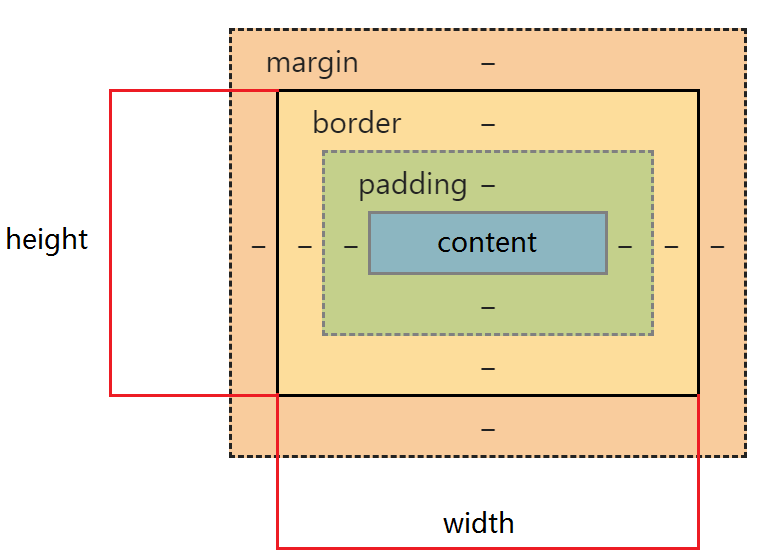

## 介绍一下盒模型
<CustomBlock title="什么是盒模型？" content="
当对一个文档进行布局时，浏览器的渲染引擎会根据标准之一的 <strong><code>CSS</code> 基础框盒模型</strong>（CSS basic box model），将所有元素表示为一个个矩形的盒子；<code>CSS</code> 决定这些盒子的大小、位置以及属性（如颜色、背景、边框尺寸等）

每个盒子（即盒模型）从外到内由这四个部分组成
<ul><li><code>margin</code> 外边距（不计入盒子的实际大小）</li><li><code>border</code> 边框</li><li><code>padding</code> 内边距</li><li><code>content</code> 内容</li></ul>
<a href='https://developer.mozilla.org/zh-CN/docs/Web/CSS/CSS_Box_Model/Introduction_to_the_CSS_box_model' target='_blank'>CSS 基础框盒模型介绍 - CSS：层叠样式表 | MDN</a>
"></CustomBlock>

盒模型分为 **`W3C` 标准盒模型**和 **`IE` 盒模型**，其区别只有一个：**计算盒子实际大小（即总宽度/总高度）的方式不一样**
* `W3C` 标准盒模型（默认）
  * **盒子实际宽 = `width` + `padding` + `border`**
  * 其中 **`width` 只包含 `content`**（即内容区域的宽度）
  * **通过 `box-sizing: content-box;` 来设置为 `W3C` 标准盒模型**
* IE 盒模型
  * **盒子实际宽 = `width`**
  * 其中 **`width` = `content` + `border` + `padding`**
  * **通过 `box-sizing: border-box;` 来设置为 `IE` 盒模型**

| W3C 标准盒模型     | IE 盒模型     |
| -------- | -------- |
|  |  |
