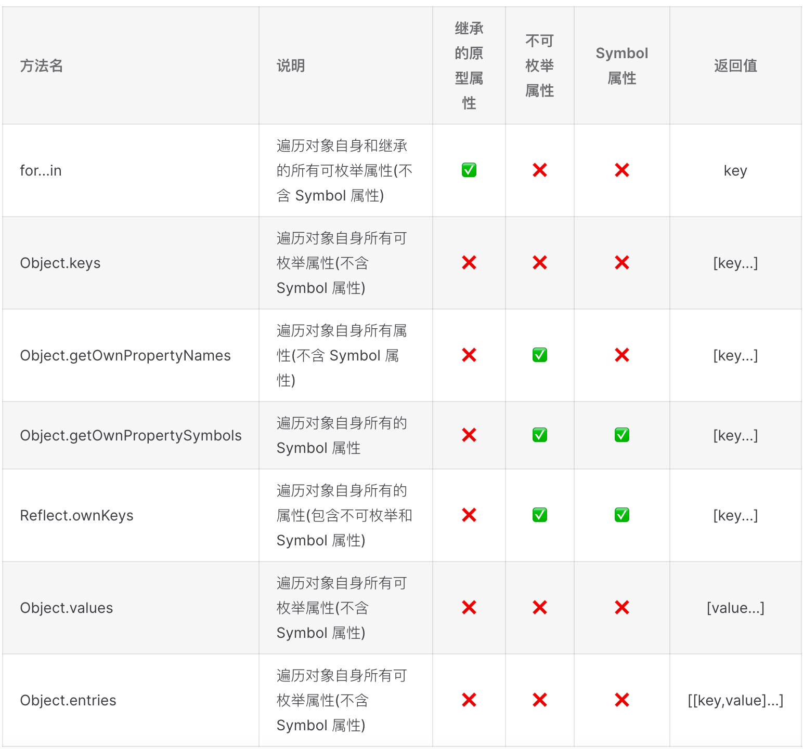

`ECMAScript 6` (简称 `ES6`) 是 `JavaScript` 语言的下一代标准

`ECMAScript` 的提案流程

* `Stage 0 - Strawman`（展示阶段）
* `Stage 1 - Proposal`（征求意见阶段）
* `Stage 2 - Draft`（草案阶段）
* `Stage 3 - Candidate`（候选人阶段）
* `Stage 4 - Finished`（定案阶段）

一个提案只要能进入 `Stage 2` 就差不多肯定会包括在以后的正式标准里面

[ECMAScript 当前的所有提案](https://github.com/tc39/ecma262)
<CustomBlock title="ES6 和 ES2015 的区别" content="<div><code>ES2015</code> 是一个年份标记，表示当年发布的 <code>ECMAScript</code> 标准的正式版本，其全称为《<code>ECMAScript 2015</code> 标准》（简称 <code>ES2015</code>）<br><code>ES6</code> 是一个历史名词也是一个泛指，含义是 <code>5.1</code> 版以后的 <code>JavaScript</code> 的下一代标准，涵盖了 <code>ES2015、ES2016、ES2017 ES2018</code> 等等</div>"></CustomBlock>

## let const
`ES6` 新增了 `let` 和 `const` 命令，用于声明变量，其声明的变量只在声明所在的块级作用域内有效
<CustomBlock title="let const var 的区别" content="<ul><li><code>var</code> 声明的变量会提升到作用域的顶部，<code>let const</code> 不存在变量提升</li><li><code>var</code> 声明的全局变量会被挂载到全局对象 <code>window</code> 上，而 <code>let const</code> 不会</li><li><code>var</code> 可以对一个变量进行重复声明，而 <code>let const</code> 不能重复声明</li><li><code>var</code> 声明的变量作用域范围是函数作用域，<code>let const</code> 声明的变量作用域范围是块级作用域</li><li><code>const</code> 声明的是一个只读的常量，一旦声明常量的值就不能改变(必须对变量进行初始化) <ul><li>基本类型保证值不可变</li><li>引用类型保证内存指针不可变</li></ul></li></ul>"></CustomBlock>

### 变量提升
``` javascript
console.log(a) // 输出 undefined
console.log(b) // 报错
console.log(c) // 报错

var a = 'var'
let b = 'let'
const c = 'const'
```
[为什么 let 和 const 不存在变量提升？ - 知乎](https://www.zhihu.com/question/535442142/answer/2510328090)
### 挂载到全局对象
``` javascript
var a = 'var'
let b = 'let'
const c = 'const'

console.log(window.a) // 输出 var
console.log(window.b) // 输出 undefined
console.log(window.c) // 输出 undefined
```
### 重复声明
``` javascript
var a = 'var'
var a
console.log(a) // 输出 var

let b = 'let'
let b // 报错
```
### 作用域范围
``` javascript
function fn() {
  if (true) {
    var a = 'var'
    let b = 'let'

    console.log(a) // 输出 var
    console.log(b) // 输出 let
  }

  console.log(a) // 输出 var
  console.log(b) // 报错
}

fn()
```
### const 常量定义
``` javascript
const NAME = 'maomao'
NAME = 'maomao1996' // 报错
```

## 模板字符串
模板字符串 (template string) 是增强版的字符串，用反引号(`)标识。它可以当作普通字符串、定义多行字符串或者在字符串中嵌入变量、函数调用以及表达式
``` javascript
let name = 'maomao'
let age = 18

/* ES5 拼接字符串 */
let es5Str = '我叫: ' + name + '，我的年龄是: ' + (age + 1) + ' 岁'

/* ES6 模板字符串 */
let es6Str = `我叫: ${name}，我的年龄是: ${age + 1} 岁`
```

## 解构赋值
### 解构对象
``` javascript
const obj = {
  name: 'maomao',
  age: 18
}

// ES5 写法
const name = obj.name
const age = obj.age

/* ES6 解构写法 */
const { name, age } = obj
// 重命名
const { name: myName } = obj

/* 指定默认值 */
const { x = 1, y = 2 } = { y: null }
console.log(x) // 1
console.log(y) // null
```
### 结构数组
``` javascript
const arr = ['maomao', 18]

/* ES5 写法 */
const name = arr[0]
const age = arr[1]

/* ES6 解构写法 */
const [name, age] = arr
const { 0: name, 1: age } = arr

/* 指定默认值 */
const [x = 1] = []
const [y = 2] = [undefined]
console.log(x) // 1
console.log(y) // 2

const [z = 3] = [null]
console.log(z) // null
```
### 解构字符串
字符串也可以解构赋值，因为字符串被转换成了一个类似数组的对象
``` javascript
const [a, b, c] = 'maomao'
console.log(a) // m
console.log(b) // a
console.log(c) // o

/* 解构 length 属性 */
const { length } = 'maomao'
console.log(length) // 6
```
<CustomBlock title="解构赋值注意点" content="<ul><li>解构数组和字符串时变量的取值由它的位置决定</li><li>解构对象时变量必须与属性同名，才能取到正确的值</li><li>变量在没有找到对应的值，多余的变量会被赋值为 <code>undefined</code></li><li>在指定默认值时，只有属性值严格等于 <code>undefined</code> 才会生效</li><li>数组本质是特殊的对象，因此可以对数组进行对象属性的解构</li><li>解构数值和布尔值时会通过其对应的包装函数将其转换成对象再解构</li><li><code>undefined</code> 和 <code>null</code> 无法转为对象，在解构时会报错</li></ul>"></CustomBlock>

## 函数的扩展
### 参数默认值
``` javascript
/* ES5 */
function add(x, y) {
  // 当参数 y 对应的布尔值为 false 则该赋值不起作用
  y = y || 1
  console.log(x + y)
}
add(10) // 11
add(10, 2) // 12
add(10, 0) // 11

/* ES6 */
function add(x, y = 1) {
  console.log(x + y)
}
add(10) // 11
add(10, 2) // 12
add(10, 0) // 10
```
<CustomBlock title="函数参数的默认值" content="<ul><li>参数变量是默认声明的不能用 <code>let</code>或 <code>const</code> 再次声明，否则会报错</li><li>使用参数默认值时函数不能有同名参数</li><li>参数默认值的位置应该是函数的尾参数</li></ul>"></CustomBlock>

### 剩余参数(rest 参数)
`ES6` 引入 `rest` 参数(形式为 `...变量名`) 用于获取函数的剩余参数(可以替换 `arguments` 对象)
``` javascript
function log(name, ...params) {
  console.log(name, params)
}

log('maomao', 1, 2) // maomao [1, 2]
log('maomao', 1, 2, 3) // maomao [1, 2, 3]
```
<CustomBlock title="剩余参数(rest 参数)" content="<ul><li><code>rest</code> 参数是一个真正的数组，数组特有的方法都可以使用</li><li><code>rest</code> 参数之后不能再有其他参数，否则会报错</li><li>函数的 <code>length</code> 属性，不包括 <code>rest</code> 参数</li></ul>"></CustomBlock>

### 箭头函数
`ES6` 允许使用箭头(`=>`)定义函数
``` javascript
// 不需要参数时使用一个圆括号代表参数部分
const fn = () => {}
// 等同于
const fn = function () {}

// 当函数体只有 return 时
const fn = (value) => value
// 等同于
const fn = function (value) {
  return value
}
```
<CustomBlock title="箭头函数与普通函数的区别" content="<ul><li><code>this</code><ul><li>普通函数 <ul><li><code>this</code> 指向是动态的(取决于函数的调用方式)</li><li>可以用 <code>call apply bind</code> 改变 <code>this</code> 指向</li></ul></li><li>箭头函数 <ul><li><code>this</code> 指向是固定的，指向定义时上层作用域中的 <code>this</code>(它没有自己的 <code>this</code>)</li><li><code>call apply bind</code> 无法改变箭头函数的 <code>this</code> 指向(上下文值始终按词法解析)</li><li>全局作用域下 <code>this</code> 指向全局对象</li></ul></li></ul></li><li>箭头函数不可以当作构造函数(不能使用 <code>new</code> 运算符，否则会报错)</li><li>箭头函数的函数体内不可以使用<code>arguments super new.target</code></li><li>箭头函数不可以使用 yield 命令(不能用作 <code>Generator</code> 函数)</li><li>在 <code>class</code> 中使用箭头函数其 <code>this</code> 会和类实例进行绑定</li></ul>"></CustomBlock>
<CustomBlock title="注意点(以下场合不应该使用箭头函数)" content="<ul><li>定义对象方法且该方法内部包括 <code>this</code> 时</li><li>定义原型方法且该方法内部包括 <code>this</code> 时</li><li>需要动态 <code>this</code> 时</li></ul>"></CustomBlock>

[利用 `babel` 编译箭头函数代码查看 `this` 的指向](https://www.babeljs.cn/repl#?browsers=defaults%2C%20not%20ie%2011%2C%20not%20ie_mob%2011&build=&builtIns=false&corejs=3.6&spec=false&loose=false&code_lz=MYewdgzgLgBANiA5jAvDAFASlQPhgbwCgYZRIQ4BTAOgUXQHI6YoALASwgC4GAaFjhEyEAvoUIAzAK5hgUduBgSwWAsRgRKUACrsAtpRBSo6VSjxESJMhAo06jZQM49-bTsJIj-ARgAMfsIiQA&debug=false&forceAllTransforms=true&shippedProposals=false&circleciRepo=&evaluate=false&fileSize=false&timeTravel=false&sourceType=script&lineWrap=true&presets=env%2Creact&prettier=false&targets=&version=7.17.11&externalPlugins=&assumptions=%7B%7D)
``` javascript
/* ES6 */
const log = () => {
  console.log('log this:', this)
}

function fn() {
  setTimeout(() => {
    console.log('fn this:', this)
  }, 100)
}

/* babel 编译后的 ES5 代码 */
var _this = this

var log = function log() {
  console.log('log this:', _this)
}

function fn() {
  var _this2 = this

  setTimeout(function () {
    console.log('fn this:', _this2)
  }, 100)
}
```
## 扩展运算符
扩展运算符 (`spread`)是三个点 (`...`) 它好比 `rest` 参数的逆运算
### 函数调用
扩展运算符在函数调用时可以将一个数组变为参数序列，从而可以替代函数的 `apply()` 方法
``` javascript
// 举个 🌰 求出一个数组最大元素
/* ES5 写法 */
Math.max.apply(null, [2022, 520, 1314])

/* ES6 写法 */
Math.max(...[2022, 520, 1314])
// 等同于
Math.max(2022, 520, 1314)
```
### 拷贝数组/对象
``` javascript
/* 拷贝数组 */
const arr1 = [1, 2, 3]
// 写法一
const arr2 = [...arr1]
// 写法二
const [...arr2] = arr1

/* 拷贝对象 */
const obj1 = { name: 'maomao' }
// 写法一
const obj2 = { ...obj1 }
// 写法二
const { ...obj2 } = obj1
```
### 合并数组/对象
``` javascript
/* 合并数组 */
const arr1 = [1, 2, 3]
const arr2 = ['a', 'b', 'c']
const arr = [...arr1, ...arr2]

/* 合并对象 */
const obj1 = { name: 'maomao' }
const obj2 = { age: 18 }
const obj = { ...obj1, ...obj2 }
```
### 使用表达式
``` javascript
const obj = {
  ...(false ? { a: 1 } : {}),
  b: 2
}
// {b: 2}

const obj = {
  ...(true ? { a: 1 } : {}),
  b: 2
}
// {a: 1, b: 2}
```
### 与解构赋值结合
``` javascript
const arr1 = [1, 2, 3]

/* ES5 写法 */
const first = arr1[0]
const rest = arr1.slice(1)

/* ES6 写法 */
const [first, ...rest] = arr1
```
<CustomBlock title="扩展运算符" content="<ul><li>使用扩展运算符拷贝数组或对象时其都是<strong>浅拷贝</strong></li><li>对象的扩展运算符等同于使用 <code>Object.assign()</code> 方法</li><li>只有函数调用时扩展运算符才可以放在圆括号中，否则会报错</li><li>扩展运算符用于赋值时只能放在参数的最后一位，否则会报错</li></ul>"></CustomBlock>

## 数组的扩展
### Array.from()
`Array.from()` 用于将两类对象转为真正的数组

* 类似数组的对象 (`array-like object`)
  * DOM 操作返回的 `NodeList`
  * `arguments` 对象
* 可遍历 (`iterable`) 的对象 (包括 `ES6` 新增的数据结构 `Set` 和 `Map`)
``` javascript
/* array-like object 转数组 */
const arrayLike = {
  0: 'a',
  1: 'b',
  2: 'c',
  length: 3
}

// ES5 写法
var arr1 = [].slice.call(arrayLike) // ['a', 'b', 'c']

// ES6 写法
let arr2 = Array.from(arrayLike) // ['a', 'b', 'c']
```
<CustomBlock title="Array.from()" content="<div><code>Array.from()</code> 可以接受一个函数作为第二个参数，作用类似于数组的<code>map()</code> 用来对每个元素进行处理，将处理后的值放入返回的数组</div><div>在字符串转为数组时 <code>Array.from()</code> 能正确处理各种 <code>Unicode</code> 字符，可以避免 <code>JavaScript</code> 将大于 <code>\uFFFF</code> 的 <code>Unicode</code> 字符算作两个字符的 <code>bug</code></div>"></CustomBlock>

### Array.of()
`Array.of()` 用于将一组值转换为数组
``` javascript
Array.of(3, 11, 8) // [3,11,8]
Array.of(3) // [3]
Array.of(3).length // 1
```
<CustomBlock title="Array.of()" content="<div><code>Array.of()</code> 方法的主要目的是弥补数组构造函数 <code>Array()</code> 的不足(因为参数个数的不同会导致<code>Array()</code>的行为有差异)</div><div><code>Array.of()</code> 总是返回参数值组成的数组。如果没有参数就返回一个空数组</div>"></CustomBlock>

### 实例方法: includes()
`includes()` 方法返回一个布尔值，表示某个数组是否包含给定的值(`ES2016` 引入)
``` javascript
const arr = [1, 2, NaN]
arr.includes(2) // true
arr.includes(4) // false
arr.includes(NaN) // true
```
<CustomBlock title="includes() 和 indexOf() 的对比" content="<div><code>indexOf()</code> 不够语义化，其含义是找到参数值的第一个出现位置，所以要去比较是否不等于 <code>-1</code>，表达起来不够直观<br><code>indexOf()</code> 内部使用严格相等运算符 (<code>===</code>) 进行判断，这会导致对 <code>NaN</code> 的误判</div>"></CustomBlock>

### 实例方法: find() 和 findIndex()
`find()` 方法用于找出第一个符合条件的数组成员，如果没有符合条件的成员则返回 `undefined`
`findIndex()` 方法用于找出第一个符合条件的数组成员的位置，如果没有符合条件的成员则返回 `-1`
``` javascript
const arr = [1, 5, 10, 15]

/* find() */
arr.find((item) => item > 9) // 10
arr.find((item) => item === 9) // undefined

/* findIndex() */
arr.findIndex((item) => item > 9) // 2
arr.findIndex((item) => item === 9) // -1
```

### 实例方法: at()
`at()` 方法接受一个整数(支持负数)作为参数返回对应位置的成员，如果参数位置超出了数组范围则返回 `undefined`
``` javascript
const arr = ['maomao', 18]

arr.at(0) // 'maomao'
arr.at(-1) // 18
arr.at(99) // undefined
```

### 实例方法: flat() 和 flatMap()
`flat()` 方法用于将嵌套的数组拍平变成一维的数组，该方法返回一个新数组不改变原数组
`flatMap()` 方法会先对原数组的每个成员执行一个函数(相当于执行 `Array.prototype.map()`) 然后对返回值组成的数组执行 `flat()` 方法，该方法返回一个新数组不改变原数组
``` javascript
/* flat() */
const arr1 = [1, 2, [3, [4, 5]]]
const arr2 = [1, 2, , 4, 5]

arr1.flat() // [1, 2, 3, [4, 5]]
arr1.flat(2) // [1, 2, 3, 4, 5]

arr2.flat() // [1, 2, 4, 5]

/* flatMap() */
const arr = [1, 2, 3, 4]
arr.flatMap((x) => [[x * 2]]) // [[2], [4], [6], [8]]
// 相当于 [[2, 4], [3, 6], [4, 8]].flat()
```
<CustomBlock title="flat() 和 flatMap() 注意点" content="<ul><li><code>flat()</code> 方法默认只会拉平一层</li><li><code>flat()</code>方法会跳过原数组中的空位</li><li><code>flatMap()</code> 只能展开一层数组</li></ul>"></CustomBlock>

## 对象的扩展
### 属性简写
`ES6` 允许在大括号里面直接写入变量和函数作为对象的属性和方法
``` javascript
/* 属性简写 */
// ES5 写法
const key = 'maomao'
const obj = { key: key }

// ES6 写法
const key = 'maomao'
const obj = { key }

/* 方法简写 */
// ES5 写法
const obj = {
  log: function () {
    console.log('maomao')
  }
}

// ES6 写法
const key = 'maomao'
const obj = {
  log() {}
}
```
<CustomBlock title="属性简写" content="简写的对象方法不能用作构造函数否则会报错"></CustomBlock>

### 属性名表达式
``` javascript
// 定义属性名
const key = 'age'
const obj = {
  ['name' + 1]: 'maomao',
  [key]: 18
}

// 定义方法名
const obj = {
  ['log' + 'name']() {
    console.log('maomao')
  }
}
```
<CustomBlock title="属性名表达式" content="<div>属性名表达式与属性简写不能同时使用否则会报错</div><div>属性名表达式如果是一个对象会自动将其转为字符串<code>[object Object]</code></div>"></CustomBlock>

### Object.is()
`Object.is()` 方法用来比较两个值是否严格相等，严格比较运算符 (`===`) 的行为基本一致
``` javascript
Object.is('key', 'key') // true
Object.is({}, {}) // false
```
<CustomBlock title="Object.is() 与 === 的不同之处" content="<codde>+0</code>不等于<code>-0</code>"></CustomBlock>

### Object.assign()
`Object.assign()` 方法用于对象的合并，将源对象的所有可枚举属性复制到目标对象（第一个参数是目标对象后面的参数都是源对象）
``` javascript
const target = { a: 1, b: 1 }

const source1 = { b: 2, c: 2 }
const source2 = { c: 3 }

Object.assign(target, source1, source2)
```
#### 只有一个参数时会直接返回该参数
``` javascript
const obj = { a: 1 }
Object.assign(obj) === obj // true
```
#### 传入参数不是对象时会先转成对象再返回
``` javascript
typeof Object.assign(1) // "object"
typeof Object.assign(true) // "object"
```
#### 传入非对象类型的场景
``` javascript
/* undefined 和 null */
// 首位参数时会报错
Object.assign(undefined) // TypeError
Object.assign(null) // TypeError
// 非首位参数时会忽略
const obj = {}
Object.assign(obj, undefined) === obj // true
Object.assign(obj, null) === obj // true

/* 非首位参数为数值 布尔值 字符串时 */
// 数值和布尔值会忽略
const obj = {}
Object.assign(obj, 1, true) === obj // true
// 字符串会以字符数组的形式做合并
Object.assign({}, 'maomao') // {0: 'm', 1: 'a', 2: 'o', 3: 'm', 4: 'a', 5: 'o'}

/* 数组 */
// 当参数都为数组时
Object.assign([1, 2, 3], [4, 5]) // [4, 5, 3]
// 当首位参数为对象时，后续参数为数组时
Object.assign({ a: 1 }, [1, 2]) // {0: 1, 1: 2, a: 1}
```
#### 传入数组时会把数组当对象处理
``` javascript
Object.assign([1, 2, 3], [4, 5]) // [4, 5, 3]
```
<CustomBlock title="Object.assign() 总结和应用场景" content="<div>总结</div><ul><li><code>Object.assign()</code> 是<strong>浅拷贝</strong>方法</li><li>存在同名属性时，后面的属性会覆盖前面的属性</li><li>只有一个参数时会直接返回该参数</li><li>传入参数不是对象时会先转成对象再返回</li><li>传入 <code>undefined</code> 和 <code>null</code> 时 <ul><li>如果为第一个参数会报错（无法转成对象）</li><li>如果不为第一个参数时会被忽略</li></ul></li><li>传入数组时会把数组当对象处理</li></ul>"></CustomBlock>

### Object.keys() Object.value() Object.entries()
`Object.keys()` 方法返回一个数组，其成员为参数对象自身的（不含继承的）所有可遍历属性的键名(`ES5` 引入)
`Object.value()` 方法返回一个数组，其成员为参数对象自身的（不含继承的）所有可遍历属性的键值(`ES2017` 引入)
`Object.entries()` 方法返回一个数组（二维数组），其成员为参数对象自身的（不含继承的）所有可遍历属性的键值对数组(`ES2017` 引入)
``` javascript
const obj = { name: 'maomao', age: 18 }
Object.keys(obj) // ['name', 'age']
Object.values(obj) //  ['maomao', 18]
Object.entries(obj) // [['name', 'maomao'], ['age', 18]]
```

### Object.fromEntries()
`Object.fromEntries()` 方法是 `Object.entries()` 的逆操作，用于将键值对的数据结构还原为对象
``` javascript
Object.fromEntries([['name', 'maomao']]) // {name: 'maomao'}

/* Map 转对象 */
const map = new Map([['name', 'maomao']])
Object.fromEntries(map) // {name: 'maomao'}

/* 将查询字符串转为对象 */
const params = 'name=maomao&age=18'
Object.fromEntries(new URLSearchParams(params)) // {name: 'maomao', age: '18'}
```

### 对象遍历方法对比

<CustomBlock title="遍历顺序" content="<div><code>ES5</code> 没有规定遍历顺序，其遍历顺序由浏览器厂商定义(可以简单理解为无序的)</div><div><code>ES6</code> 之后规定遍历顺序将按如下规则进行</div><ol><li>首先遍历所有数值键，按照数值升序排列。</li><li>其次遍历所有字符串键，按照加入时间升序排列。</li><li>最后遍历所有 <code>Symbol</code> 键，按照加入时间升序排列。</li></ol><div><code>ES6</code> 内部定义了 [[OwnPropertyKeys]]() 方法对属性进行分类和排序</div>"></CustomBlock>