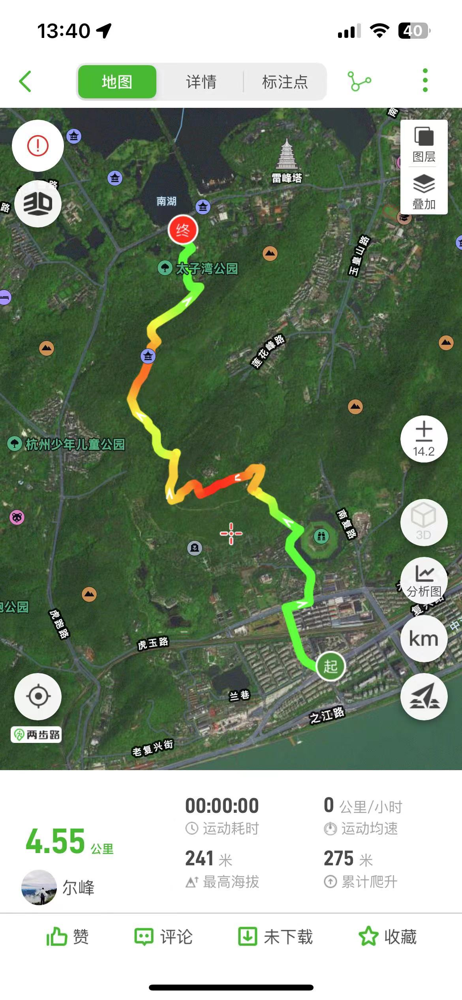
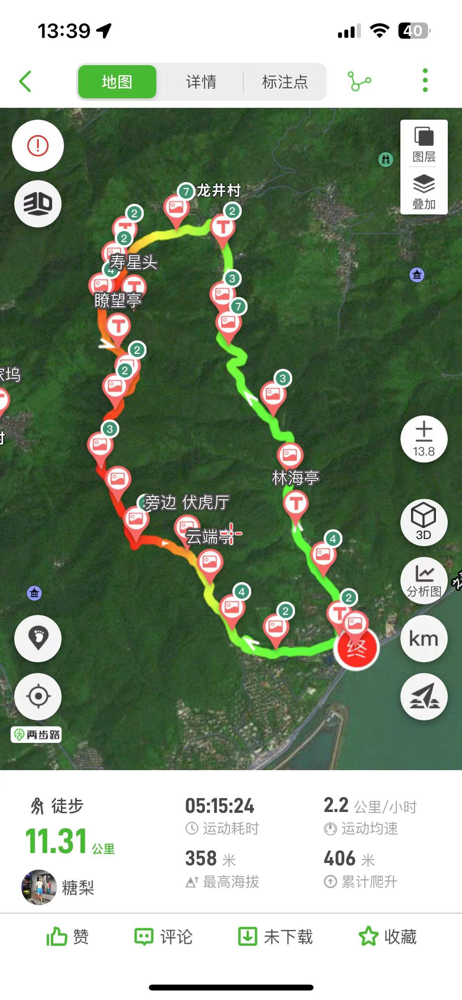
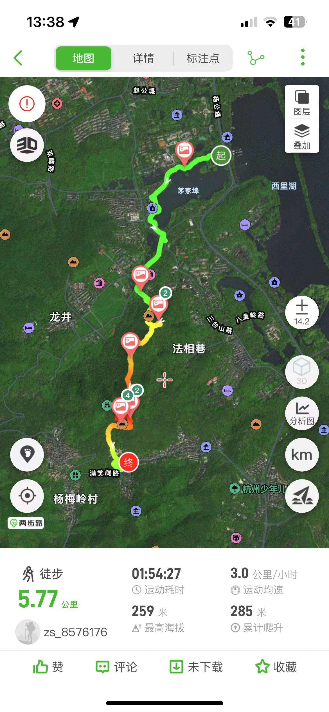
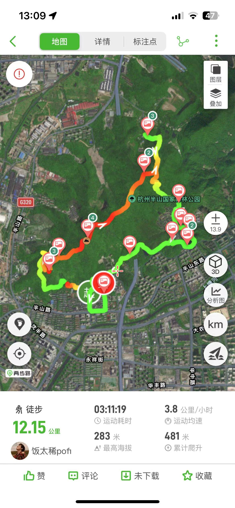
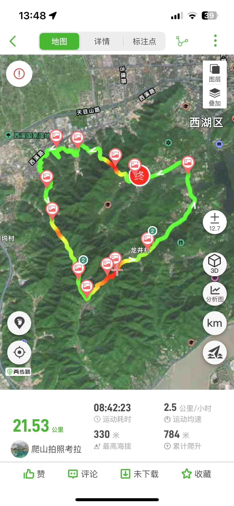
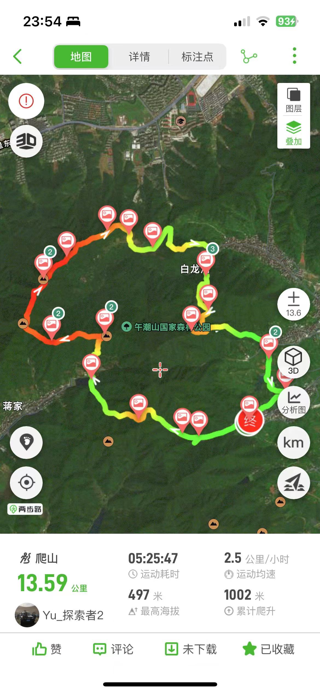
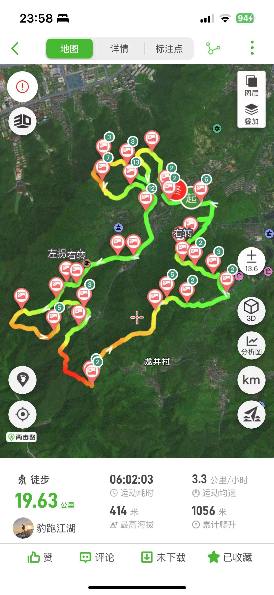
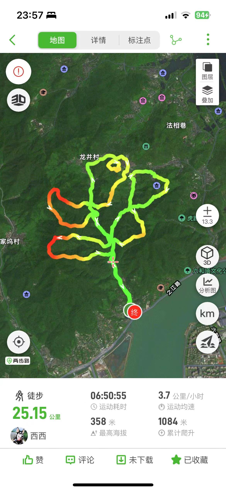
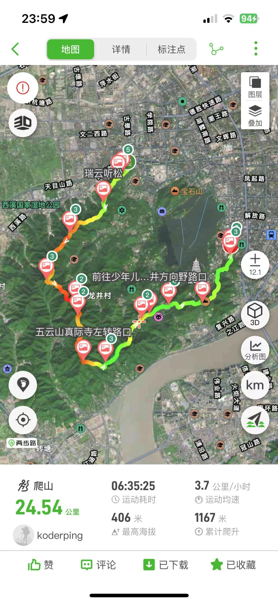
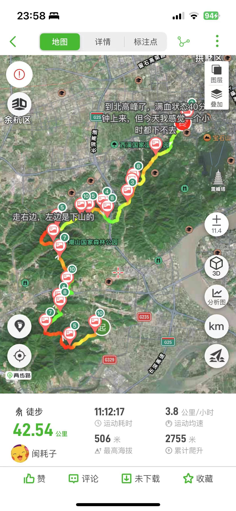

🌈：杭州这座孕育着千百年历史的古城，隐藏着许多有意思且经典的徒步路线，你走过哪一条呢？
⛰：每一条山脊都值得遇见，挑个空闲的周末出发吧。

## 徒步路线
### 🍏：八卦田-太子湾

### 🍉：十里琅珰（九溪-法喜寺）

### 🍑：上香古道

### 🍇：半山画牛
路程：12公里左右\
爬升：450米\
时间：3小时\
轨迹：两步路搜索“半山画牛”即可\
强度：初级。适合初学者，整体强度不大，环山公路，景区游步道以及小部分野路\
天气好在望宸阁观景会很不错，整体爬升不大。初学者建议从环山公路这个方向走，想挑战的建议从另外一个方向出发。中间有野路坡度较大，挑战不了的建议绕台阶，前腿要翻小区铁门，注意安全

### 🥝：左爱心线

### 🍌：小玫瑰（简易版）
路线情况：\
全程16公里，累计爬升600米左右，以游步道和土路为主。\
📍路线起点：\
杭州的西湖群山九溪公交站\
注意下，最后一段画花蕊，要进入到茶叶博物馆里面的，茶叶博物馆下午4点就停止进入了，得要抓紧时间哦

### 🍐：湘湖群山环线
整个线路大体可以分为四个部分

part1:城山广场的越王祠\
爬的第一座山，下山会走野路，整体难度一般，这条路线没太多好风景，有个望湘亭可以拍湘湖风景。

part2:癞子山-华眉山-老虎洞山-莲花古寺\
这应该是整个路线的精华了，难度中等偏上，上山和下山全是岩石路或土路，风景也比较好，适合拍照。在这里碰到了两位六七十岁的老人，太厉害了，希望自己老了也能有这样的毅力和体力。

part3:环湘湖平路\
绕着湘湖走，全是平路，也可以骑车走这段，路上都是湘湖景，也不错。路过湘湖花海，现在花还是开着的。

part4:石岩山-柴岭山\
全是铺装好的路，沿路也有很多地方可以拍城市边界线。

整个路线距离比较长，需要有比较好的耐力，不建议新手走完。part2是最难最精华的，也可以先只走这部分，两步路上应该也有很多路线。

### 🥥：西湖群山右爱心
全程大约21公里\
累计爬升700米+\
耗时7小时左右\

【路线】
少年宫（起点🇨🇳）➡️宝石山（俯瞰西湖真的太美啦！）➡️青芝坞（民宿聚集地）➡️石虎山➡️灵隐寺➡️月桂峰➡️五老峰隧道（不得不说🚗尾气太重了，记得带好😷）➡️满觉陇➡️九曜山（登顶风景很👍）➡️南山路➡️湖滨➡️少年宫（终点🏁）

### 🍍：午潮山豆腐皮古道
位置：杭州豆腐皮古道（西山森林公园）\
⏱️用时：4-6 小时，约 14 公里\
⛰️爬升：1050\
🧸年龄：8 岁+\
🏋️难度：⭐️⭐️⭐️⭐️\
🌲路线构成：主要由石板路、野路、石子路构成\
🚌公共交通：乘坐地铁到野生动物园站，打车前往\
🚗自驾：导航搜索豆腐皮古道⚠️千万别搞错成西山森林公园，隔着一个山脊呢，导航大洋坞水库也可以，水库有免费停车场🅿️

游玩路线：\
从大洋坞水库右手边开始，进入小路两边会有竹笋可以挖（不要忘记热身哦）\
沿着小路一直向前，路边青石绿苔，绿意盎然，野趣开始啦！一直走到鉴远亭，三岔路口沿左手边上山！\
从鉴远亭左手边上山脊路线，到飞凤岩-大德岭，最后回到大洋坞水库，一路上都有标识牌，不用怕迷路

### 🍍：十二生肖（2023年兔子）
首先感受：人多人多人多人多……\
车子限行进不去出发点，得下车徒步到起点再开始画兔子，一上来就是 4 公里的徒步开胃菜。\
线路：兔前腿(里鸡笼山公交站)—兔嘴(天竺书院)—兔耳（财神庙）—兔背(中法路)—兔尾巴（天竺寺）—兔后腿（天竺山）—兔下腹—兔前腿。\
全程：19 公里左右。\
最高海拔 400m。\
爬升海拔 1100m。\
推荐指数：🌟🌟🌟🌟适合新手进阶。

### 🍒：风月无边
2018年清明，杭州一位叫魏旗的男子为了纪念其不幸患癌去世的妻子，从九溪出发，经九溪烟树、龙井村、十里琅珰、满觉陇等地的兜兜转转，最终又回到九溪。从地图轨迹上看，像极了一朵玫瑰，故这段路线也被人称为西湖群山最浪漫的路线，简称“西湖玫瑰线”。
游侠客与时俱进，在其基础上，创新的推出了一条疾速新线，取名“风月无边”。全程约24.6km，累计爬升1200m，分为5个花瓣，保留整个路线的精华路段，土路占比多，野趣十足。该线一经推出，便一跃成为炙手可热的徒步路线，众游侠都跃跃欲试、踊跃报名，在感动这一份深情的同时，希望用自己的脚步去丈量，一步一步的走出一朵西湖野玫瑰。

### 🍋：西湖群山标毅
西湖群山徒步标准毅行线，简称“标毅线”，风景很赞的一条线路。

概述：全程25KM，1300米爬升，约6-8小时

途径：老和云起→将军山→美女山→灵峰山→北高峰→美人峰→龙门山→石人峰→狮子笼→狮峰→十里琅珰（部分）→万林背山→五云山→伏虎亭→林海亭（九溪）→贵人峰→少儿公园→四眼井→古井一路→玉皇山环山公路→老玉皇宫→凤凰山（万松书院后山）→浙江省革命烈士纪念馆→吴山→吴山大观

需要路线导航，可以下载“两步路”app，搜索“标毅线”。

路程较长，分段均有下撤点\
1.北高峰：可以乘坐缆车或者徒步下撤到灵隐寺\
2.石人亭：下撤到法喜寺\
3.狮峰：刚从天门山汇入十里琅珰，可以下撤到龙井村\
4.林海亭：可以下撤到“九溪”公交站\
5.贵人阁：土路下撤到少儿公园，石阶下撤到虎跑公园\
6.玉皇山环山公路：下撤到玉皇山脚\
7.烈士纪念馆：凤凰山下山就到了万松书院旁的节义亭

易错分岔点
* 石人亭往十里琅珰方向\
A：23号电话亭，进入土路的路口。
* 五云山→林海亭\
A：五云山下山时，沿着台阶路走，一个拐角处接土路路口。\
B：土路中，碰到一个白房子，往左边的土路。
* 贵人阁→少儿公园\
A：贵人阁沿着石阶下山约500米，看到一个垃圾桶，有个土路岔口。
* 古井一路→玉皇山环山公路\
A：土路分叉路。\
B：碰到一个空阔茶园后，需要汇入玉皇山环山公路，岔路往左。

### 🍊：风浙线
路线名称：疯浙线（风浙线）\
公里数及爬升：42.3公里，爬升3000米\
起点终点：西山国家森林公园灵山景区，到老和云起牌坊\
强度：强。小白劝退，该路线专治各种不服。没有走过单日30公里爬升1500以上的，不推荐。可以分段练习\
风景：三颗星，灵山风景

